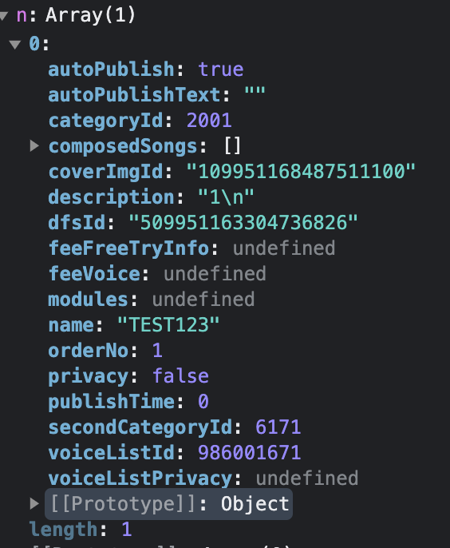
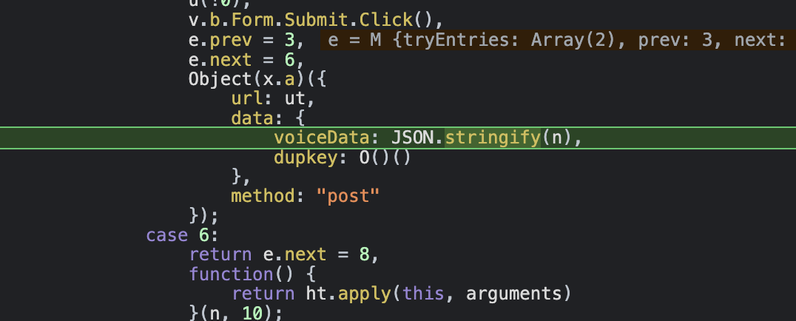
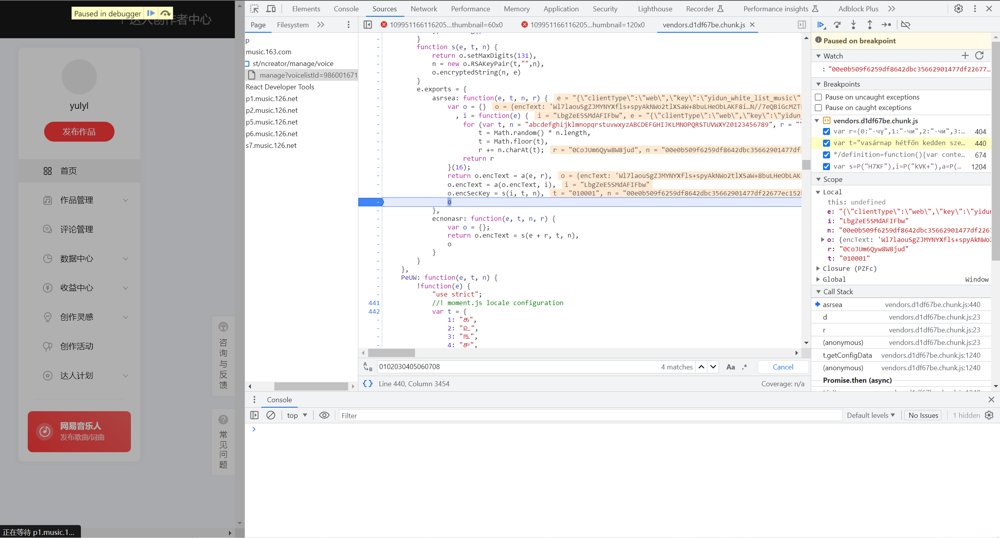
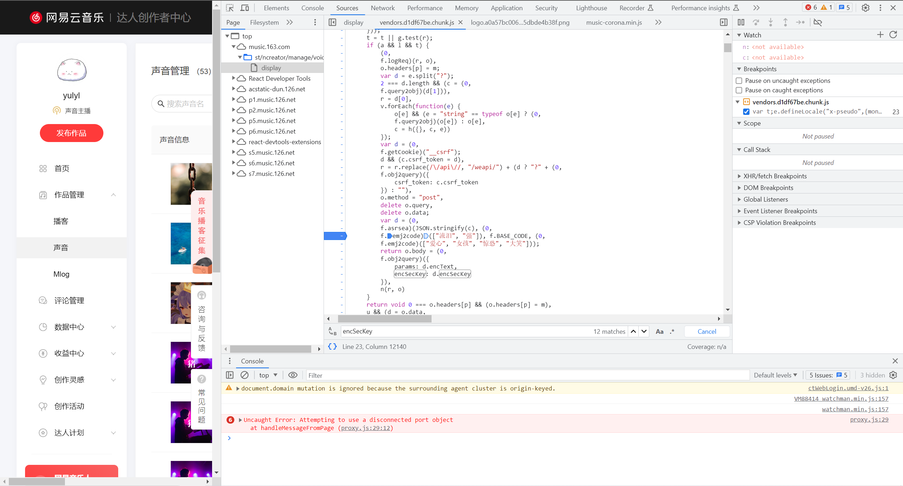
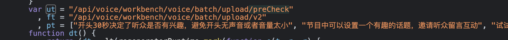
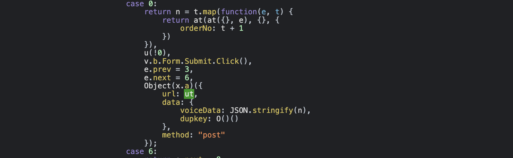

## 网易云

### 播客-下载流程

1. Alloc

   ```js
   fetch("https://music.163.com/api/nos/token/alloc?filename=%E5%96%80%E7%A7%8B%E8%8E%8E(%E5%B0%91%E6%88%98).mp3&ext=mp3&type=other&bucket=ymusic&local=false&nos_product=0", {
     "headers": {
       "accept": "application/json",
       "accept-language": "zh-CN,zh;q=0.9,en-US;q=0.8,en;q=0.7,zh-TW;q=0.6",
       "content-type": "application/x-www-form-urlencoded",
       "sec-ch-ua": "\"Not/A)Brand\";v=\"99\", \"Google Chrome\";v=\"115\", \"Chromium\";v=\"115\"",
       "sec-ch-ua-mobile": "?0",
       "sec-ch-ua-platform": "\"Windows\"",
       "sec-fetch-dest": "empty",
       "sec-fetch-mode": "cors",
       "sec-fetch-site": "same-origin"
     },
     "referrer": "https://music.163.com/st/ncreator/upload?userType=3",
     "referrerPolicy": "strict-origin-when-cross-origin",
     "body": null,
     "method": "POST",
     "mode": "cors",
     "credentials": "include"
   });
   
   {
       "code": 200,
       "result": {
           "bucket": "ymusic",
           "docId": "509951163304242201",
           "objectKey": "EaACHxgc1i_5adnFcy13tA==/509951163304242201",
           "token": "UPLOAD 037a197cb50b42468694de59c0bdd9b1:zLgSQ9DTJAXpkk6jZXuDYGie3KrZ7Kh7Xsp49u3cveU=:eyJCdWNrZXQiOiJ5bXVzaWMiLCJSZWdpb24iOiJIWiIsIk9iamVjdCI6IkVhQUNIeGdjMWlfNWFkbkZjeTEzdEE9PS81MDk5NTExNjMzMDQyNDIyMDEiLCJFeHBpcmVzIjoxNjkyNDU0MTY4fQ=="
       }
   }
   ```

17. Upload

    ```js
    fetch("https://ymusic.nos-hz.163yun.com/EaACHxgc1i_5adnFcy13tA==/509951163304242201?uploads", {
      "headers": {
        "accept": "*/*",
        "accept-language": "zh-CN,zh;q=0.9,en-US;q=0.8,en;q=0.7,zh-TW;q=0.6",
        "sec-ch-ua": "\"Not/A)Brand\";v=\"99\", \"Google Chrome\";v=\"115\", \"Chromium\";v=\"115\"",
        "sec-ch-ua-mobile": "?0",
        "sec-ch-ua-platform": "\"Windows\"",
        "sec-fetch-dest": "empty",
        "sec-fetch-mode": "cors",
        "sec-fetch-site": "cross-site",
        "x-nos-meta-content-type": "audio/mpeg",
        "x-nos-token": "UPLOAD 037a197cb50b42468694de59c0bdd9b1:zLgSQ9DTJAXpkk6jZXuDYGie3KrZ7Kh7Xsp49u3cveU=:eyJCdWNrZXQiOiJ5bXVzaWMiLCJSZWdpb24iOiJIWiIsIk9iamVjdCI6IkVhQUNIeGdjMWlfNWFkbkZjeTEzdEE9PS81MDk5NTExNjMzMDQyNDIyMDEiLCJFeHBpcmVzIjoxNjkyNDU0MTY4fQ=="
      },
      "referrer": "https://music.163.com/",
      "referrerPolicy": "strict-origin-when-cross-origin",
      "body": null,
      "method": "POST",
      "mode": "cors",
      "credentials": "omit"
    });
    
    <?xml version="1.0" encoding="UTF-8"?>
    <InitiateMultipartUploadResult>
      <Bucket>ymusic</Bucket>
      <Key>EaACHxgc1i_5adnFcy13tA==/509951163304242201</Key>
      <UploadId>6924469692300594086</UploadId>
    </InitiateMultipartUploadResult>
    ```

18. Part

    ```js
    fetch("https://ymusic.nos-hz.163yun.com/EaACHxgc1i_5adnFcy13tA==/509951163304242201?partNumber=1&uploadId=6924469692300594086", {
      "headers": {
        "accept": "*/*",
        "accept-language": "zh-CN,zh;q=0.9,en-US;q=0.8,en;q=0.7,zh-TW;q=0.6",
        "sec-ch-ua": "\"Not/A)Brand\";v=\"99\", \"Google Chrome\";v=\"115\", \"Chromium\";v=\"115\"",
        "sec-ch-ua-mobile": "?0",
        "sec-ch-ua-platform": "\"Windows\"",
        "sec-fetch-dest": "empty",
        "sec-fetch-mode": "cors",
        "sec-fetch-site": "cross-site",
        "x-nos-token": "UPLOAD 037a197cb50b42468694de59c0bdd9b1:zLgSQ9DTJAXpkk6jZXuDYGie3KrZ7Kh7Xsp49u3cveU=:eyJCdWNrZXQiOiJ5bXVzaWMiLCJSZWdpb24iOiJIWiIsIk9iamVjdCI6IkVhQUNIeGdjMWlfNWFkbkZjeTEzdEE9PS81MDk5NTExNjMzMDQyNDIyMDEiLCJFeHBpcmVzIjoxNjkyNDU0MTY4fQ=="
      },
      "referrer": "https://music.163.com/",
      "referrerPolicy": "strict-origin-when-cross-origin",
      "body": "ID3\u0003\u0000\u0000\u000000\u0000\u0001¤\u0000\u0000\u0000 \u0000\u00004\u0000\u0000\u0004LAME3.99.5UUULAME3.990·····················001Ó$dÌûpÙ1",
      "method": "PUT",
      "mode": "cors",
      "credentials": "omit"
    });
    
    HTTP/1.1 200 OK
    Date: Sat, 19 Aug 2023 12:09:43 GMT
    Content-Type: application/octet-stream
    Content-Length: 0
    Connection: keep-alive
    x-nos-request-id: 3d73df78-a932-48c1-88b5-f658bc42947f
    x-nos-requesttype: UploadPart
    Access-Control-Expose-Headers: etag
    Access-Control-Allow-Origin: *
    Access-Control-Allow-Methods: GET,POST,OPTIONS,PUT,DELETE
    ETag: a22b76bc3ae07e3cac1a65ddaff4df2b
    Server: nos/v1.0.2
    ```

19. https://ymusic.nos-hz.163yun.com/EaACHxgc1i_5adnFcy13tA==/509951163304242201?partNumber=2&uploadId=6924469692300594086

20. https://ymusic.nos-hz.163yun.com/EaACHxgc1i_5adnFcy13tA==/509951163304242201?partNumber=3&uploadId=6924469692300594086

21. https://ymusic.nos-hz.163yun.com/EaACHxgc1i_5adnFcy13tA==/509951163304242201?partNumber=4&uploadId=6924469692300594086

22. https://ymusic.nos-hz.163yun.com/EaACHxgc1i_5adnFcy13tA==/509951163304242201?partNumber=5&uploadId=6924469692300594086

23. https://ymusic.nos-hz.163yun.com/EaACHxgc1i_5adnFcy13tA==/509951163304242201?partNumber=6&uploadId=6924469692300594086

24. ------------------------点击立即发布后------------------------

26. !!!

    ```js
    fetch("https://interface.music.163.com/weapi/voice/workbench/voice/batch/upload/preCheck?csrf_token=055120bba7694c3328379b3110b0507f", {
      "headers": {
        "accept": "application/json",
        "accept-language": "zh-CN,zh;q=0.9,en-US;q=0.8,en;q=0.7,zh-TW;q=0.6",
        "content-type": "application/x-www-form-urlencoded",
        "sec-ch-ua": "\"Not/A)Brand\";v=\"99\", \"Google Chrome\";v=\"115\", \"Chromium\";v=\"115\"",
        "sec-ch-ua-mobile": "?0",
        "sec-ch-ua-platform": "\"Windows\"",
        "sec-fetch-dest": "empty",
        "sec-fetch-mode": "cors",
        "sec-fetch-site": "same-site"
      },
      "referrer": "https://music.163.com/",
      "referrerPolicy": "strict-origin-when-cross-origin",
      "body": "params=9Vl8IAphnNplmZP%2Bjr%2FLK8fy7Zq143Gr2eIyglcrmplBgmW%2FwjZg%2Fg6asY08525y%2Ba0chBS5sfImfuQQs1MuX4v1PPUsfi8D6KlfrT%2FKi%2Bas458UN0Jk5eregC0TG6gDB2PJ0ETMEnLTw62SSILKh8pjXkoJgQ3GLShDWveZsu5tkVNIqSwh%2B%2BOsWAFOpCkeWHkMqkV47wQAYggOXVcRXdQcwtBTel2rwEOhMTT3hw%2Bjut716f26aFaNNUrJZ7HjQAfwwlHN5RcwT6VMbLwCLKZfMOKm6w4CvfnhdM%2BK8RAVLw0uK2%2BjurITwL2qR8QW8IOLoj9AKjjnpOSwmDbQe3eo5r2ZRTVCvqlHbzV1N%2FDU7vfqJwdpYV5cL3%2Fq8puj13sIu77CJ55wM%2FdMEjHSf3gTevfYn4CUHYR8hexbbl%2F0y%2FXW%2FdxeYmbb1ny3YLyzugPkzOc7uQx9jlD0FgznTele5PEIDM5%2FXyQFaP5rTSH%2FCLa3xusE2wXF17wb8yqy7zH6HVTgeGML%2Fn08ucXl2X5FBVxl6k46ASUQzq8fMEIM6JPlnKYNngd1wpheBpG%2BCnCNns72ap9hLoco5a7m13r5ZfRobdHRkQP7j%2BqUGed19zdoX%2Fvv1HkC399K7lrNh6xKNndGw%2FXnvhMKN9E5pS29T2m8o57z1dV0qLQvBEemLzn%2Bh3EtY0XVrny%2FcFXk%2Bo%2BuqqDyAjg73s4sxNLRxJHx45cAInnVa9hI7ayGya%2BZbTQtxHw2n7ifP8uJpVHzFhzyaWpwKq7snW%2BRw1uMLvJA40OyiHIUiWufNxgISi2kCcBWVuOVFYaNL5EDDxib4TvZzpTK4CsH9U1sWkdGry1BITSa9lbIAPSyiyCjjRjbTn9HiOVq5JCaeOvgTbUBgs3qa49reZdp8e880bGm9fEIeY4hQUqyJe%2FwwCpmBlxblXbJZF29IVtWGGLgmSwGk%2BGQVd%2FukJEl5lus%2BehfB%2FhhbCUnsVT49nDndHqYwCfsNvgGodyG7foSgLzJcijxHHOy85ZJDqqho9CVsUYvH%2FMHS89Eocm%2BS07W2cAPtrQ%3D&encSecKey=c7574214326be3ab0b67053d9f229daa91676501fb70cfca7111dc19500cf04fe5bd248b241e0f822dc1c4cd0ab0a1dfebb8a2e7cb4e8e8d45eba3dd9285b7b1c69966b94151916d490da1a8f20929a1a67e630159848cfea5a20f22eed8173f00a92711e969422cf0f2832107581a159f1a193955fab6a8fc57ae2dc460d493",
      "method": "POST",
      "mode": "cors",
      "credentials": "include"
    });
    
    {"code":200,"data":true,"message":""}
    ```

11. !!!

    ```js
    fetch("https://interface.music.163.com/weapi/voice/workbench/voice/batch/upload/v2?csrf_token=055120bba7694c3328379b3110b0507f", {
      "headers": {
        "accept": "application/json",
        "accept-language": "zh-CN,zh;q=0.9,en-US;q=0.8,en;q=0.7,zh-TW;q=0.6",
        "content-type": "application/x-www-form-urlencoded",
        "sec-ch-ua": "\"Not/A)Brand\";v=\"99\", \"Google Chrome\";v=\"115\", \"Chromium\";v=\"115\"",
        "sec-ch-ua-mobile": "?0",
        "sec-ch-ua-platform": "\"Windows\"",
        "sec-fetch-dest": "empty",
        "sec-fetch-mode": "cors",
        "sec-fetch-site": "same-site"
      },
      "referrer": "https://music.163.com/",
      "referrerPolicy": "strict-origin-when-cross-origin",
      "body": "params=dYB%2BfUlh0TBeCbnI52UlA3ELJAl87BshAyTqbsa8DHaYt7uRz9QEmLSN%2BDamZ7k%2FGlgzll2tKVGO9FfmhTkuokiicKFdGBTqW%2BVJ%2BskbMDuFoc78v%2BaJ24sSyoEw5SZnTDR4Tqq1lEk%2B4b1sHLgDZH2PnqI1gZhJnbu9XEz143GZdPrBg3qMD9gPzoF%2BS7JKUzIvgqs1%2BYHXvtOjxY23Ivfu37u9rTA7abBfDvgI9otPNlNy0km1WyiZIVERI7allIl3dy2OmSpzeIdxyyvB42mGP4bI91tXO%2FcKAdIx6fzUJQMGTyKyu%2Bs%2FdoUgv%2BLoeskEiqeAj4BlN2Wxcfh52bfpwnHBp%2Fna10bnUomnlBSZSxT6xwDcqVDZg8cndoRBVD6QKsQYYjqXSUv0g2hmIfR1K%2B9I%2FqgPxyqR3O8XjSJdUC2G40ifb7f%2Bx0vlxZgwdMkc4912uQfpCGSCNehTx725GZ%2Fvc7Nn3DkCXlO3TLnRdkQqlxTyU2bCdhxHnQIjkrCQArLnJUGdMR4km4z0TfoNx%2FdexmJIRyCmtWuxw8jhhgx%2FOGe3Qq7vJFzRmP%2F72RMl4mMrlGGESJFY7suE6J1rSfu5uhqSxw4lm2bXP49ioWnh6dZntZ3SxBatYzR5Y9Sfg4IV8pYn6RjvvY9qdXKJJSeT6StRZBf7N88UqiMxWuqgYVZkqGMIsgwKy6RvLaAykhT%2BqcdRVImYRZjlvzZ4vIlcz4EyHIUAfPESsXYsdLUqSKBdc70QfMvfeeTMYW0H310S4wFJxkpKLZ79Qf80mS4vTjoS5Rsu1eHjk8JSbIf1YIYk5bxSP7nz5FhNgSyKkj6kNflALq3iGYE3LBI0hLW2yhskvDZGAniIx4EppiYls7hkS2Z8Dbg1YE2HXYrlWTSDh5hEQENHbH%2B%2BOEOAvCFTikX%2B0HKSaI2Ed5MFyD6ukXyjBAEMqe1xNma1xFEdx%2BpZtoISEuMUsuQ8SzaKZfgAnU8jxC60AwrsyEj6YTdCwwvJurrrFJQ5ahVaHmSzDMbbuIJEp%2BwIekYWrFpTHnN8C0Uy8twHF%2FXM43o%3D&encSecKey=8025594e0e8b1c50403641a224a11e352a80f1742f20cfa22aa5d01e41d26d02ded56ac5461dddcf6dfdb3f6d7803ce2be927d65936a6ad5f66a3b945cd5064d9aaf7d8cfe96c4f6bfed82e9ea35ad705de2f8d2feabffde8047cd4437855d17a295f49c957d99881fe612243f82835393a6662307bf78ae01e59319a9b13259",
      "method": "POST",
      "mode": "cors",
      "credentials": "include"
    });
    
    {
      "code": 200,
      "data": [
        2527846569
      ],
      "message": ""
    }
    ```

    ### 提交参数





1. ```js
   Object(x.a)({
     url: ut,
     data: {
       voiceData: JSON.stringify(n),
       dupkey: O()() [
         vendors.4564b4a9.chunk.js
         xk4V: function(e, t, n) {
           var a = n("4fRq")
             , u = n("I2ZF");
           e.exports = function(e, t, n) {
               var r = t && n || 0;
               "string" == typeof e && (t = "binary" === e ? new Array(16) : null,
               e = null);
               var o = (e = e || {}).random || (e.rng || a)();
               if (o[6] = 15 & o[6] | 64,
               o[8] = 63 & o[8] | 128,
               t)
                   for (var i = 0; i < 16; ++i)
                       t[r + i] = o[i];
               return t || u(o)
           }
       }
       ]
     },
     method: "post"
   });
   ```

2. ```json
   data:
   	dupkey: "0f50d114-199a-4b3e-8013-e980c78cfb8b"
   	voiceData: "[
   {"name":"Cupid",
   "autoPublish":false,
   "autoPublishText":"",
   "description":"1\n",
   "voiceListId":986001671,
   "coverImgId":"109951168487511100",
   "dfsId":"509951163304753013",
   "categoryId":2001,
   "secondCategoryId":6171,
   "composedSongs":[],
   "privacy":true,
   "publishTime":0,
   "orderNo":1}
   ]"
   	method: "post"
   	url: "/api/voice/workbench/voice/batch/upload/preCheck"
   ```

3. ```json
   {
       "url": "/api/voice/workbench/voice/batch/upload/preCheck",
       "data": {
           "voiceData": "[{\"name\":\"Cupid\",\"autoPublish\":false,\"autoPublishText\":\"\",\"description\":\"1\\n\",\"voiceListId\":986001671,\"coverImgId\":\"109951168487511100\",\"dfsId\":\"509951163304753013\",\"categoryId\":2001,\"secondCategoryId\":6171,\"composedSongs\":[],\"privacy\":true,\"publishTime\":0,\"orderNo\":1}]",
           "dupkey": "0f50d114-199a-4b3e-8013-e980c78cfb8b"
       },
       "method": "post",
       "noEnc": false,
       "credentials": "include",
       "withCredentials": true,
       "headers": {
           "Accept": "application/json",
           "Content-Type": "application/x-www-form-urlencoded"
       },
       "body": "dupkey=0f50d114-199a-4b3e-8013-e980c78cfb8b&voiceData=%5B%7B%22name%22%3A%22Cupid%22%2C%22autoPublish%22%3Afalse%2C%22autoPublishText%22%3A%22%22%2C%22description%22%3A%221%5Cn%22%2C%22voiceListId%22%3A986001671%2C%22coverImgId%22%3A%22109951168487511100%22%2C%22dfsId%22%3A%22509951163304753013%22%2C%22categoryId%22%3A2001%2C%22secondCategoryId%22%3A6171%2C%22composedSongs%22%3A%5B%5D%2C%22privacy%22%3Atrue%2C%22publishTime%22%3A0%2C%22orderNo%22%3A1%7D%5D"
   }
   ```

4. 随机aes密钥生成位置

5. ```js
   // vendors.4564b4a9.chunk.js
   PZFc: function(e, t, n) {
           "use strict";
           var r = n("SdIM")
             , o = n("o6JC");
           function a(e, t) {
               var n = r.enc.Utf8.parse(t)
                 , t = r.enc.Utf8.parse("0102030405060708")
                 , e = r.enc.Utf8.parse(e);
               return r.AES.encrypt(e, n, {
                   iv: t,
                   mode: r.mode.CBC
               }).toString()
           }
           function u(e, t, n) {
               return o.setMaxDigits(131),
               n = new o.RSAKeyPair(t,"",n),
               o.encryptedString(n, e)
           }
           e.exports = {
               asrsea: function(e, t, n, r) {
                   var o = {}
                     , i = function(e) {
                       for (var t, n = "abcdefghijklmnopqrstuvwxyzABCDEFGHIJKLMNOPQRSTUVWXYZ0123456789", r = "", o = 0; o < e; o += 1)
                           t = Math.random() * n.length,
                           t = Math.floor(t),
                           r += n.charAt(t);
                       return r
                   }(16);
                   return o.encText = a(e, r),
                   o.encText = a(o.encText, i),
                   o.encSecKey = u(i, t, n),
                   o
               },
               ecnonasr: function(e, t, n, r) {
                   var o = {};
                   return o.encText = u(e + r, t, n),
                   o
               }
           }
       }
   ```
   
6. 

7. 

### 分享

1. 找到代码文件upload.bc2e29bc.chunk.js
2. 根据Network知道的接口/voice/batch/upload/preCheck全局搜索
3. 找到参数名ut，继续全局搜索
4. 找到使用ut的地方，打上断点


## JAVAScript逆向

https://blog.csdn.net/weixin_43411585/article/details/109798452

### hook

```js
var _eval=eval
eval=function(arg){
console.log(arg)
    return _eval(arg)
}

var cookie = document.cookie;
document = Object.defineProperty(document, 'cookie', {
  get: function () {
    console.log('getter: ' + cookie);
    return cookie;
  },
  set: function (value) {
    console.log('setter: ' + value);
    cookie = value
  }
});
```

### js hook方法检测与过检测

```js
console.log(eval+"");
var _eval=eval
eval=function(arg){
console.log(arg)
    return _eval(arg)
}
console.log(eval+"");
eval.toString()
// 这种方式过于简单，而且能被代{过}{滤}理器检测到，所以还可以检测原型链上的toString方法
var a=eval+""
var _eval=eval
eval=function(arg){
console.log(arg)
    return _eval(arg)
}
eval.toString=function(){return "function eval() { [native code] }"}
console.log(eval+"");
console.log(a===(eval+""))
console.log(Function.prototype.toString.call(eval))
```

### proxy与浏览器

```js
const handler = {
    get: function(obj, prop) {
        console.log(obj,prop)
        return prop in obj ? obj[prop] : 37;
    }
};

const p = new Proxy({}, handler);
// 但是我们为什么不在浏览器里面写Proxy而是只在nodejs里面写呢，因为在浏览器中window对象是不能重写的，自然就不能重写window的代{过}{滤}理器，所以我们只能在nodejs中使用Proxy，因为不能重写window就索然无味,但是我们可以监听新赋值的变量，例如有一些变量我们不知道他是什么时候生成的在哪里生成的我们就可以使用下面的这种技巧。
Object.defineProperty(window,"dta",
    {
        get:function (){
            return "hook dta"
        },
        set:function (){
            debugger;
        }
    }
)
```

### js一键快速hook框架

首先举一个例子，我比较懒想要快速hook一个base64编码函数，但是又不想写冗长的代码怎么办呢，这里主要参考了珍惜大佬的js课程并进行了一定程度的修改，那么就需要写一个`hook`函数来帮助我们一劳永逸。首先要解决第一个问题就是如何让所有的对象都能访问到我们的hook方法呢，这里我们可以将hook方法定义在原型链上

`Function.prototype.hook=function(){}`

接下来时第二个问题，如何保存原方法，可以用下面这种形式

```js
var _this=this ;
var Functionname=_this.name;
if(!Functionname)
{
    console.log("hook erro")
    return false;

}
window.dta[Functionname]=this;
// 最后直接重写方法即可
Function.prototype.hook=function (onEnter,onLeave,context) {
    var _this = this;
    window.dta={};
    var _context = context || window;
    var Functionname = _this.name;
    if (!Functionname) {
        console.log("hook erro")
        return false;

    }

    window.dta[Functionname] = this;
    _context[Functionname] = function () {
console.log(arguments)
        var args = Array.prototype.slice.call(arguments, 0);
        var _this = this;
        var warpper = {args}
        onEnter.call(_this, warpper);
        var result = window.dta[Functionname].apply(this, warpper.args);
       console.log(result)
        var retuenval = onLeave.call(_this, result)
        if (!retuenval) {
            return retuenval
        }
        return result;
    }
}
btoa.hook(function (warpper){
    var args=warpper.args;
    console.log(args)

    },function (retval){
    console.log(retval)
    return true
    }

)
// 当然这只是最基础的hook方式我们还要过一些简单的检测，比如重写他的toString方法去掉他的一些修改特征，这种古老又有效的方法，最终成品如下
(() => {
    const $toString = Function.toString
    const myFunction_toString_symbol = Symbol('('.concat('', ')_', (Math.random()) + '').toString(36))
    const myToString = function (){
        return typeof this === 'function' && this[myFunction_toString_symbol] || $toString.call(this)
    }
    function set_native(func, key, value){
        Object.defineProperty(func, key, {
            enumerable: false,
            configurable: true,
            writable: true,
            value: value
        })
    }
    delete Function.prototype.toString
    set_native(Function.prototype, "toString", myToString)
    set_native(Function.prototype.toString, myFunction_toString_symbol, "function toString() { [native code] }")
    globalThis.func_set_native = (func) => {
        set_native(func, myFunction_toString_symbol, `function ${func.name || ''}() { [native code] }`)
    }
}).call(this)

window.dta = {}
Function.prototype.hook = function(onEnter, onLeave, context, Funcname){
    if (!onEnter){
        onEnter = function (warpper){
            var args = warpper.args;
            console.log(args)
        }
    }
    if (!onLeave){
        onLeave = function (retval){
            console.log(retval)
        }
    }

    // btoa.hook()
    var _context = context || window;
    var FuncName = this.name || Funcname;
    if (!FuncName){
        console.error("hook function name is empty!")
        return false
    }
    window.dta[FuncName] = this;

    _context[FuncName] = function (){
        var args = Array.prototype.slice.call(arguments,0)
        var _this = this
        var warpper = {
            args
        }

        onEnter.call(_this, warpper)
        // this -> window
        var retval = window.dta[FuncName].apply(this, warpper.args)

        var hook_retval = onLeave.call(_this, retval)
        if (hook_retval){
            return hook_retval
        }
        return retval
    }
    Object.defineProperty(_context[FuncName], "name", {
        get: function (){
            return FuncName
        }
    })
    func_set_native(_context[FuncName])
}

console.log("quick hook start")
```