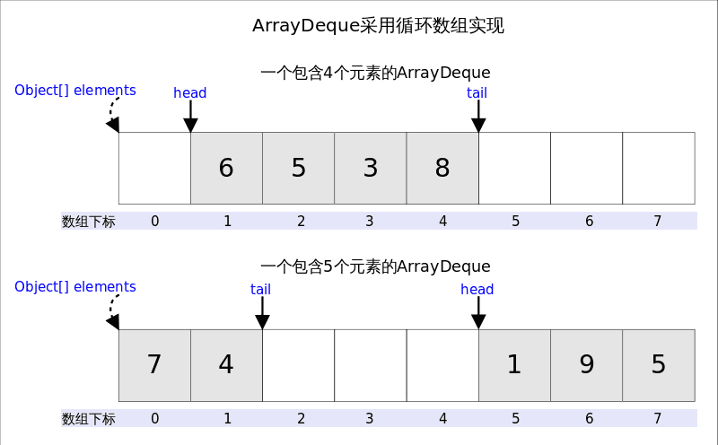

## 泛型

- extend

	`Vector<? extends 类型1> x = new Vector<类型2>();`

	类型1指定一个数据类型，那么类型2就只能是类型1或者是类型1的子类
	
	使用此变量时不可以向`T`设置、添加元素，因为`T`接收的是`T`和他的子类，此时存储的元素应该是哪个子类无法确定，所以添加元素就会报错，所以只能获取元素
	
	总结：通配符的上界，不能进行写入数据，只能进行读取数据。

- super

  `Vector<? super 类型1> x = new Vector<类型2>();`

  类型1指定一个数据类型，那么类型2就只能是类型1或者是类型1的父类

  使用此变量时不可以接收`T`的具体类型，只能接收`Object`类型，因为无法确定具体是哪个父类，可以设置、添加`T`或`T`的子类。

  总结：通配符的下界，不能进行读取数据，只能进行写入数据。

- 为什么没办法`public <T extends Iterator<E> & Iterable<E>> T iterX(){}`?

- 不可 `T extends Iterator<E> & Iterable<E>`

  ```java
  (a)
  public <T extends Iterator<E> & Iterable<E>> T iterX(){}
  (b)
  public class ValueIterx implements Iterator<E>,Iterable<E>{
      public void Iterator<T> iterator() {
          return this; //(1)      
          return new XXXX() //(2)  
  	}
  }
  1.兼容1.4，否则Iterator无法编译。
  2.潜在问题：
  (1)写法，有问题，返回一个可变的this。
  (2)写法，没问题，返回别的对象或自己的快照。
  ```

### 为什么lambda内累加要用AtomicInteger,不能用int累加?

## 泛型1

<? extends T> 表示类型的上界，表示参数化类型的可能是T 或是 T的子类;
<? super T> 表示类型下界（Java Core中叫超类型限定），表示参数化类型是此类型的超类型（父类型），直至Object;

### 1.代码示例

//比如，我们现在定义：List<? extends T>首先你很容易误解它为继承于T的所有类的集合，你可能认为，你定义的这个List可以用来put任何T的子类，那么我们看下面的代码


```java
public class test {
    public static void main(String[] args) {
        List<? extends Father> list = new LinkedList<>();
        list.add(new Son());
    }
}
class Human{
}
class Father extends Human{
}
class Son extends Father{
}
class LeiFeng extends Father {
}
```
### 2.代码分析

`//list.add(new Son());这行会报错：The method put(Son) is undefined for the type List<capture#1-of ? extends Father>`
List 表示 “具有任何从Father继承类型的列表”，编译器无法确定List所持有的类型，所以无法安全的向其中添加对象。可以添加null,因为null 可以表示任何类型。所以List 的add 方法不能添加任何有意义的元素，但是可以接受现有的子类型List 赋值。

//也许可以尝试这么做
`List<? extends Father> list = new LinkedList<Son>();`
`list.add(new Son());`

即使你指明了为Son类型，也不能用add方法添加一个Son对象。

list中为什么不能加入Father类和Father类的子类呢，我们来分析下

//List<? extends Father>表示上限是Father,下面这样的赋值都是合法的
`List<? extends Father> list1 = new ArrayList<Father>();`
`List<? extends Father> list2 = new ArrayList<Son>();`
`List<? extends Father> list3 = new ArrayList<LeiFeng>();`

如果List支持add方法的话：

list1可以add Father和所有Father的子类；
list2可以add Son和所有Son的子类；
list3可以add LeiFeng和所有LeiFeng的子类。
//下面代码是编译不通过的：
 ``list1.add(new Father());//error`
 `list1.add(new Son());//error`` 

原因是编译器只知道容器内是Father或者它的派生类，但具体是什么类型不知道。可能是Father？可能是Son？也可能是LeiFeng，XiaoMing？编译器在看到后面用Father赋值以后，集合里并没有限定参数类型是“Father“。而是标上一个占位符：CAP#1，来表示捕获一个Father或Father的子类，具体是什么类不知道，代号CAP#1。然后无论是想往里插入Son或者LeiFeng或者Father编译器都不知道能不能和这个CAP#1匹配，所以就都不允许。

所以通配符``和类型参数的区别就在于，对编译器来说所有的T都代表同一种类型。比如下面这个泛型方法里，三个T都指代同一个类型，要么都是String，要么都是Integer。

`public <T> List<T> fill(T... t);`

//但通配符`<?>`没有这种约束，`List<?>`单纯的就表示：集合里放了一个东西，是什么我不知道
//所以这里的错误就在这里，List<? extends Father>里什么都放不进去。
`//List<? extends Father> list`不能进行add，但是，这种形式还是很有用的，虽然不能使用add方法，但是可以在初始化的时候一个Season指定不同的类型。比如：

`//List<? extends Father> list1 = getFatherList();`//getFatherList方法会返回一个Father的子类的list

另外，由于我们已经保证了List中保存的是Father类或者他的某一个子类，所以，可以用get方法直接获得值

```java
List<? extends Father> list1 = new ArrayList<>();
Father father = list1.get(0);//读取出来的东西只能存放在Father或它的基类里。
Object object = list1.get(0);//读取出来的东西只能存放在Father或它的基类里。
Human human = list1.get(0);//读取出来的东西只能存放在Father或它的基类里。
Son son = (Son)list1.get(0);
```

### 3.下界

```java
//super只能添加Father和Father的子类，不能添加Father的父类,读取出来的东西只能存放在Object类里
List<? super Father> list = new ArrayList<>();
list.add(new Father());
list.add(new Human());//compile error 
list.add(new Son());
Father person1 = list.get(0);//compile error 
Son son = list.get(0);//compile error 
Object object1 = list.get(0);
```

因为下界规定了元素的最小粒度的下限，实际上是放松了容器元素的类型控制。既然元素是Father的基类，那往里存粒度比Father小的都可以。出于对类型安全的考虑，我们可以加入Father对象或者其任何子类（如Son）对象，但由于编译器并不知道List的内容究竟是Father的哪个超类，因此不允许加入特定的任何超类（如Human）。而当我们读取的时候，编译器在不知道是什么类型的情况下只能返回Object对象，因为Object是任何Java类的最终祖先类。但这样的话，元素的类型信息就全部丢失了

### 4.总结

最后看一下什么是PECS（Producer Extends Consumer Super）原则，已经很好理解了：

频繁往外读取内容的，适合用上界Extends。
经常往里插入的，适合用下界Super
extends 可用于返回类型限定，不能用于参数类型限定（换句话说：? extends xxx 只能用于方法返回类型限定，jdk能够确定此类的最小继承边界为xxx，只要是这个类的父类都能接收，但是传入参数无法确定具体类型，只能接受null的传入）。
super 可用于参数类型限定，不能用于返回类型限定（换句话说：? supper xxx 只能用于方法传参，因为jdk能够确定传入为xxx的子类，返回只能用Object类接收）。
? 既不能用于方法参数传入，也不能用于方法返回
<?  SomeClass>与<T extends SomeClass>的区别

//看apache parquet源码时，发现代码各种泛型嵌套，有必要系统整理一下关于泛型的各种知识，在此做一总结。
//首先是名词对应表，不需要记住右边的名字，但需要知道左边的各种用法

`List<String> —- 参数化的类型` 
`List<E> —- 泛型` 
`List<?> —- 无限制通配符类型` 
`<E extends SomeClass> —- 有限制类型参数` 
`List <? extends SomeClass>—- 有限制通配符类型` 
`<T extends Comparable<T>> —– 递归类型限制` 
`static <E> List<E> asList(E[] a) —- 泛型方法`

//下面自己的实验包括代码，标号1是解决题目里描述的问题，其余的标号也是自己遇到的一些关键的问题。

### 4.疑问解答

`<E extends ClassA> 与 <? extends ClassA>有什么区别？`

 答：当我第一次接触这两名词时，感觉他们的功能是一样的，T可以代表任意的子类，?也可以代表任意的子类。 
首先我们明确一下两边的名字，限制类型 & 通配符类型，<E extends ClassA>表示后续都只能使用E进行某些判断或操作，而<? extends ClassA>？表示后续使用时可以是任意的。 
举个<E extends ClassA>最常见的例子，用于比较操作，比如返回“最大值”，“最大值”的定义为：整型、浮点型返回最大值，字符串返回字典序最大者，由于想调用compareTo函数，我们让所有参数都继承Compareble,即T extends Comparable<T>，整个测试代码如下

```java
package test;

/**

 * 定义了 <T extends someClass>, 

 * 里面的代码便只能用somClass的子类T进行比较或其他操作。
   */
     public class MaximumTest {

   // determines the largest of three Comparable objects
   public static <T extends Comparable<T>> T maximum(T x, T y, T z) {                      
      T max = x; // assume x is initially the largest       
      if ( y.compareTo( max ) > 0 ) {
         max = y; // y is the largest so far
      }
      if ( z.compareTo( max ) > 0 ) {
         max = z; // z is the largest now                 
      }
      return max; // returns the largest object   
   }

   public static void main(String args[])  {
      System.out.printf( "Max of %d, %d and %d is %d\n\n", 
                   3, 4, 5, maximum( 3, 4, 5 ) );

       System.out.printf( "Maxm of %.1f,%.1f and %.1f is %.1f\n\n",
                   6.6, 8.8, 7.7, maximum( 6.6, 8.8, 7.7 ) );
         
       System.out.printf( "Max of %s, %s and %s is %s\n","pear",
         "apple", "orange", maximum( "pear", "apple", "orange" ) );

   }
     }

//注释里已经写清楚了，我们只能用T类型来进行一些操作，我们不能把T替换成?，因为？并不是一个类名，它只是一个通配符，然后举个<? extends ClassA>的例子。
```


比如我们有一个Stack类，类里提供一个pullAll方法，我们想把一系列元素全部放到堆栈中，如下方法

```java
   // Stack定义
   public class Stack<E> {
       public Stack();
       public E pop();
       public boolean isEmpty();
   }

   // ...
   public <E> void pushAll(Iterable<E> src) {
       for(E e : src) {
           push(e);
       }
   }
```

这个方法编译时没问题，Iterable src的元素类型与堆栈的类型完全匹配就没有问题。但是假如有一个Stack调用了push(intVal)，这里的intVal是Integer类型，这是可以的，因为Integer是Number的一个子类型，但下面的代码会报编译错误

```java
Stack<Number> numberStack = new Stack<Number>();
Iterable<Integer> integers = "...";
numberStack.pushAll(integers);
```


因为在Java中，参数化类型是不可变的。所以现在我们的通配符类型就派上用场了，代码如下

```java
public void pushAll(Iterable<? extends E> scr) {
    for( E e : src) {
        push(e);
    }
}
```

List<Object> o = new ArrayList<Long>(); 报错
//不同于数组Object[] o，Long[] o，因为List<Type1>与List<Type2>不互为子类型or超类型

## 泛型2

###  1.方法泛型与强转

泛型最常见的用法是为容器添加类型变量，让编译器提供类型检查和自动类型转换
比如常见的返回值包装类：

```java
@Data
public class Result<T> {
    private Integer code;
    private String message;
    private T data;
}
```


####  方法泛型

因为这是一个非常常用的类，所以我们经常添加 ` 静态工厂方法 ` 和 ` 链式调用/流式编程 `

```java
@Data
@Accessors(chain = true)//设置 lombok 生成链式调用的 setter 方法，setter方法的返回值从 void 变为 Result<T>
public class Result<T> {
    private Integer code;
    private String message;
    private T data;

    public static <O> Result<O> ok() {
        //生产用的ok()还会进行一些其他的优化，比如因为存在大量的 return Result.ok()，避免每次都new一个对象
        return new Result<O>().setCode(200).setMessage("success");
    }
    //这里还会有其他的静态方法 如 ok(O data), err(), err(String message)等
}
```


这里我们就用到了方法泛型，因为静态方法只能通过定义方法泛型才能使用类型变量，而如果不使用类型变量，就只能返回 ` Result<?> ` 、 `
Result<Object> ` ，或者原始类型 ` Result ` ，这都会导致你没办法像使用构造函数 ` Result<String> = new
Result<>(); ` 那样方便的使用静态工厂方法 —— ` Result<String> ok = Result.ok(); `

####  利用方法泛型进行强转

但是定义了方法泛型之后，我们面临第二个问题就是,我们没办法通过链式调用返回任意泛型

```java
    public Result<String> getString1(){
        return Result.ok();//这是可以的，类型参数被自动推断为String
    }
   public Result<String> getString2(){
        return Result.ok().setData("hello");//这不行，类型参数被自动推断为 Object ,与返回值不兼容，无法通过编译
   }
```


这个时候，我们只能在方法名前加上尖括号，手动指定类型变量的具体类型：

```java
public Result<String> getString3(){
    return Result.<String>ok().setData("hello");//麻烦的要死
}
```

这个时候就需要强转了，我们把 lombok 生成的 ` setData ` 改造一下
原本的 ` setData ` :

```java
public Result<T> setData(T data) {
    this.data = data;
    return this;
}
```


强转后的 ` setData ` :

```java
@SuppressWarnings("unchecked")
public <O> Result<O> setData(O data) {
    this.data = (T) data;
    return (Result<O>) this;
}
```

正因为 ` Result<T> ` 中的 ` T ` 只跟 ` data ` 字段有关，所以更改 ` data ` 字段的方法就可以使用方法泛型来强转
这样一来，链式调用就行得通了

```java
public Result<String> getString3(){
    return Result.ok().setData("hello");//行得通的了
}

public Result<Result<String>> getString4() {
    return Result.ok()
            .setData("hello") //此时引用是 Result<String>
            .setData(1) //此时引用是 Result<Integer>
            .setData(1L) //此时引用是 Result<Long>
            .setData(Result.ok().setData("hello")) //此时引用是 Result<Result<String>>
            //想怎么set就怎么set，链式调用顺滑多了
            ;
}
```


这种链式调用+方法泛型和强转是优秀API设计常用的手法，比如大名鼎鼎的 ` Caffeine ` 在builder的时候就有这样的代码:

```java
@NonNull
public <K1 extends K, V1 extends V> Caffeine<K1, V1> expireAfter(
    @NonNull Expiry<? super K1, ? super V1> expiry) {
  //...
  @SuppressWarnings("unchecked")
  Caffeine<K1, V1> self = (Caffeine<K1, V1>) this;
  self.expiry = expiry;
  return self;
}
```


并且提醒我们因为引入了强转，方法调用后泛型参数发生了变化，要链式调用而不是使用之前的引用

####  ? 、 supper 、extends 、&

jdk中和泛型有关的类大量使用了 ` ? supper ` 和 ` ? extends `  
比如 ` List<E> ` 的 ` addAll ` 方法:


​    
​    addAll(Collection<? extends E> c);

` Iterable<T> ` 中的 ` forEach ` 方法：

```java
default void forEach(Consumer<? super T> action) {
    Objects.requireNonNull(action);
    for (T t : this) {
        action.accept(t);
    }
}
```

那么问题来了，为什么List的add方法还是 ` boolean add(E e); ` ，这里却要用 ` Collection<? extends E>
` 和 ` Consumer<? super T> ` 呢？

这是因为，这里的 ` List<E> ` 类型变量 ` E ` 和 ` Iterable<T> ` 的 ` T ` 还会出现在另外一个对象( `
Collection<?> ` 和 ` Consumer<?> ` )的泛型参数的尖括号 ` <> ` 中的，此时存在两个泛型，一个是 ` List<?>
` 一个是 ` Collection<?> `

####  泛型的不变性

而涉及到第二个泛型时，就会发生两个泛型边界的兼容问题，而除非通过 ` extends ` 或 ` super `
显式声明了泛型边界，否则只有两个泛型严格对齐才能通过编译——即，泛型是类型不变的，泛型类不因参数类型之间的关系而具备关系， ` List<String> `
和 ` List<Object> ` 之间不具备 ` List - List ` 以外的类型关系， ` List<Object> a = new
ArrayList<String>() ` 无法像 ` Object[] a = new String[0] ` 那样通过编译

####  extends ：为泛型引入协变性

> 协变： 变型 (variance)时，保留了类型的顺序（≤），将类型从更具体到更通用的顺序：若类型关系中 ` A ≤ B ` 可得 ` I<A> ≤
> I<B> ` ，则 ` A => I<A> ` 为协变。  
> 如 ` String ≤ Object ` => ` String[] ≤ Object[] ` ,所有 ` Object[] `
> 可以存在的地方，都可以是 ` String[] `

即，如果 ` List<E> ` 的 ` addAll ` 方法是 ` addAll(Collection<E> c); ` 的话

```java
public static class MyList<E> {
    void add(E e){}
    void addAll(Collection<E> c) {}
    void forEach(Consumer<E> consumer){}
}

@Test
void test_2022_08_07_23_29_24() {
    MyList<Object> list = new MyList<>();
    list.add("strings");//这样可以，因为存在向上转型
    list.addAll(Arrays.asList("1", "2"));//这样也是可以的，因为Arrays.asList存在方法泛型所以发生了类型推导
    List<String> strings = Arrays.asList("1", "2");
    list.addAll(strings);//尴尬了,居然无法通过编译
    list.addAll(Arrays.<String>asList("1", "2"));//这样也不行，显式指定方法泛型，没有了类型推导
}
```


` List<Object> ` 可以add ` String ` ，但居然没办法addAll ` List<String> ` 这不就太难受了吗

所以根据addAll的语义，通过 ` Collection<? extends E> ` 定义泛型变量的边界 ，使其方法参数获得获得协变性

####  super ：为泛型引入逆变性

> 逆变： 变型 (variance)时，反转了类型的顺序：若类型关系中 ` A ≤ B ` 可得 ` I<A> ≥ I<B> ` ，则 ` A =>
> I<A> ` 为逆变。

` Consumer<? super T> ` 也是同理 ，使方法参数在 ` Consumer<String> ` 与 ` Consumer<String>
` 之间达成 ` String ≥ Object ` 的逆变

```java
@Test
void test_2022_08_07_23_43_15() {
    MyList<String> list2 = new MyList<>();
    Consumer<Object> consumer = Object::toString;
    list2.forEach(consumer);//尴尬了,居然无法通过编译
    list2.forEach(Object::toString);//这样可以，因为方法引用的类型推断，自动转为Consumer<String>了
}
```


####  &

& 用于 extends 中，用于标明该类型实现了多个接口，比如 ` Collections ` 中的 ` min ` 和 ` max `
方法，就要求参数的集合中的元素必须是Object的子类，并且实现 ` Comparable ` 接口，并且 ` Comparable ` 接口的泛型参数是
` <? super T> ` ，即元素 ` T ` 不能是抽象类或者接口，且必须能够对元素自身进行比较

```java
public static <T extends Object & Comparable<? super T>> T min(Collection<? extends T> coll) {
    Iterator<? extends T> i = coll.iterator();
    T candidate = i.next();

    while (i.hasNext()) {
        T next = i.next();
        if (next.compareTo(candidate) < 0)
            candidate = next;
    }
    return candidate;
}
```


###  2.自限定泛型

在刚才的 ` Collections ` ，我们看到一个复杂的泛型定义——“不能是抽象类或者接口，且能够排序自身”，后者这点其实就有点自限定泛型的意味了  
不过由于 ` Comparable ` 接口只要求排序某个对象，而不是排序自身：

```java
public interface Comparable<T> {
    public int compareTo(T o);
}
```


那么怎么才能定义一个能够排序自身的 ` Comparable ` 呢？这就用到一个烧脑的泛型定义——自限定泛型了：

```java
interface SelfComparable<T extends SelfComparable<T>> extends Comparable<T> {
}
```


这就要求，在具体化这个泛型参数时，必须填入一个能够排序自身的排序类，比如

```java
static abstract class MyNumber1 implements SelfComparable<MyNumber1> {

}
```


当然，这并不能完全限制必须是排序自身：

```java
static abstract class MyNumber2222 implements SelfComparable<MyNumber1> {

}
```

虽然大部分时候，这种限制都足够了，但如果需要完全的自限定，则需要运行时检查，或者像 ` Collections.min `
一样转换为主动的方法调用利用方法泛型来进行额外的泛型边界限定，比如：

```java
interface SelfComparable<T extends SelfComparable<T>> extends Comparable<T> {
    @SuppressWarnings("unchecked")
    default boolean check() {
        return check(getClass());
    }
    //如果非反射的编程方式调用此方法，在不使用原始类型和强转的情况下，方法参数的泛型类型不是自限定则不能通过编译
    //这里只是一个示例，没有检测父类接口情况和其他的一些例外情况，实际情况中通过第三方库（如 typetools ）解析更为方便
    static <T extends SelfComparable<T>> boolean check(Class<T> clazz) {
        for (Type type : clazz.getGenericInterfaces()) {
            if (type instanceof ParameterizedType) {
                ParameterizedType parameterizedType = (ParameterizedType) type;
                if ((parameterizedType).getRawType().equals(SelfComparable.class)) {
                    Type[] arguments = parameterizedType.getActualTypeArguments();
                    if (arguments.length > 0 && arguments[0].equals(clazz)) {
                        return true;
                    }
                }
            }
        }
        return false;
    }
}
```


###  3.泛型参数协变性与协变返回类型

如果不使用泛型，java的方法参数也是不变的，既不具备协变性，也不具备逆变性：

```java
class TestA{
    public void fun(Number num){}
    public Number fun2(Number num){}
}
class TestB extends TestA{
    //@Override // 无法重写使参数为父类，只能重载
    public void fun(Object num){}
    //@Override // 无法重写使参数为子类，只能重载
    public void fun(Integer num){}
    @Override // 可以重写使返回类型为子类，方法返回值是协变的
    public Integer fun2(Number num){return null;}
}
```


但是在引入泛型之后，就可以在子类重写方法的参数类型了：

```java
class TestA<N extends Number> {
    public void fun(N str) {
    }
}
class TestB extends TestA<Integer> {
    @Override // 可以重写为Number的子类了
    public void fun(Integer str) {
    }
}
class TestC<O extends AtomicLong> extends TestA<O> {
    @Override
    public void fun(AtomicLong str) {//然而，如果子类也用了泛型，重写时会发生边界问题
    }
//  @Override
//  public void fun(O str) {//这两种重写都是可以的，但是后者不接受 AtomicLong 类型，只接受AtomicLong的子类
//  }
}
```


使用泛型作为参数类型和返回类型的好处在于，可以为方法的参数和返回值通过泛型 **显式引入协变性**

###  4.利用自限定泛型和泛型参数协变性设计通用链式调用API接口

目的:这样就通过泛型完成了链式调用的接口和公共代码抽取，并利用泛型自动协变来使子类特性不被链式调用时覆盖

如果我们想设计一个上传的API

```java
FileInfo uploder(Object...args);
```

由于上传本身，数据来源常见的有5种 ` byte[] ` 、 ` MultipartFile ` 、 ` InputStream ` 、 ` File `
、 ` URL `

确定好数据之后，为上传的文件设置的属性常见的也有5种 ` filename(String filename) ` 、 `
fileFullName(String fileFullName) ` 、 ` fileExtension(String fileExtension) `
、 ` basePath(String basePath) ` 、 ` directory(String directory) `

而像这种存在大量可选参数设置的API，如果没有分阶段的链式调用，比如某SDK：


 _简直是重载地狱_

简洁的API设计方法时通过分阶段分解上传调用，再结合Builder模式和链式调用，只需要完成5+5=10个方法即可完美调用，而不是

> 重载方法数量： 1个(10参数方法，绝地天通) ~ 5个（6参数方法，丑陋之极）~ 5*5=25个（1~6参数，勉强能用）~
> 5*(2^5-1)=155个（保证不存在某个调用的某个参数一直为null的全吻合调用，但接口地狱绘卷）


```java
class FileStorage {
    UploadStarter uploader();//开始上传，进入分阶段的文件上传链式调用流程
    
    boolean exists(URI fileUri);
    
    void delete(URI fileUri);
    
    InputStream download(URI fileUri);
}
class UploadStarter {
    UploadOptions from(byte[] bytes, String filename);

    UploadOptions from(MultipartFile multipartFile, String filename);

    UploadOptions from(InputStream inputStream, String filename);

    UploadOptions from(File file);

    UploadOptions from(URL url);
}
class UploadOptions {
    UploadOptions filename(String filename);

    UploadOptions fileFullName(String fileFullName);

    UploadOptions fileExtension(String fileExtension);

    UploadOptions basePath(String basePath);

    UploadOptions directory(String directory);

    FileInfo upload();//上传结束，返回最终文件信息
}
```


**然而，当我们使用之后，就会发现一个问题，文件存储本身是有多个实现的——本地存储和云存储之间的API有共同的地方，也有不同的地方，不同云存储之间也存在差异**

**怎么样让这样一个链式调用的API能够具备多种实现类，并且每种实现类具有自己的额外方法，又能继承相同的公共代码呢？**

这就要用到自限定泛型和泛型返回值与参数了：

####  以文件存储API为例，使用自限定泛型和泛型返回值完成链式调用

```java
/**
 * 文件存储
 */
//为了省去不必要额外泛型参数，这里使用了通配符
public interface FileStorage<L extends FileStorage.UploadStarter<?>> { 

    L uploader();

    boolean exists(String fileUri);

    void delete(String fileUri);

    void rename(String fileUri, String newFilename);

    void copy(String sourceFileUri, String targetFileUri);

    InputStream download(String fileUri);

    /**
     * 上传启动器
     */
    interface UploadStarter<T extends UploadOptions<T>> {
        T from(byte[] bytes, String filename);

        T from(MultipartFile multipartFile, String filename);

        T from(InputStream inputStream, String filename);

        T from(File file);

        T from(URL url);
    }

    /**
     * 上传选项参数
     */
    interface UploadOptions<T extends UploadOptions<T>> {
        T filename(String filename);

        T fileFullName(String fileFullName);

        T fileExtension(String fileExtension);

        T basePath(String basePath);

        T directory(String directory);

        FileInfo upload();
    }
```

在此基础上，提取公共代码实现抽象类，比如 ` AbstractUploadOptions ` ，具体本地存储或者不同云存储就能实现自己 `
FileStorage ` 、 ` UploadStarter ` 、 ` UploadOptions `

```java
public abstract class AbstractUploadOptions<T extends AbstractUploadOptions<T>> implements FileStorage.UploadOptions<T> {
    protected File file;
    protected InputStream inputStream;
    protected String filename;
    protected String originalFilename;
    protected String fileExtension = "";
    protected URI uri;
    protected String rootPath;
    protected String basePath;
    protected String directory = "";
    protected String fullPath;

    protected AbstractUploadOptions(String rootPath, String basePath, File file) {
        this(rootPath, basePath, Objects.requireNonNull(file), null, file.getName());
    }

    protected AbstractUploadOptions(String rootPath, String basePath, InputStream inputStream, String fileFullName) {
        this(rootPath, basePath, null, Objects.requireNonNull(inputStream), fileFullName);
    }

    protected AbstractUploadOptions(String rootPath, String basePath, File file, InputStream inputStream, String fileFullName) {
        this.rootPath = rootPath;
        this.basePath = basePath;
        this.originalFilename = fileFullName;
        this.inputStream = inputStream;
        this.file = file;
    }
```

```java
    @Override
    @SuppressWarnings("unchecked")
    public T filename(String filename) {
        String fileExt;
        if (StringUtils.hasText((fileExt = FileUtil.getSuffix(filename)))) {
            this.fileExtension = fileExt;
        } else {
            filename = FileStrUtil.changeFileExtension(filename, this.fileExtension);
        }
        this.filename = filename;
        calculateFullPath();
        if (this.originalFilename == null) {
            this.originalFilename = filename;
        }
        return (T) this;
    }

    @Override
    @SuppressWarnings("unchecked")
    public T fileFullName(String fileFullName) {
        this.filename = fileFullName;
        this.fileExtension = FileUtil.getSuffix(fileFullName);
        calculateFullPath();
        if (this.originalFilename == null) {
            this.originalFilename = fileFullName;
        }
        return (T) this;
    }

    @Override
    @SuppressWarnings("unchecked")
    public T fileExtension(String fileExtension) {
        if (fileExtension.startsWith(StrUtil.DOT)) {
            fileExtension = fileExtension.substring(1);
        }
        if (StringUtils.hasText(filename)) {
            this.filename = FileStrUtil.changeFileExtension(filename, fileExtension);
        }
        this.fileExtension = fileExtension;
        calculateFullPath();
        return (T) this;
    }

    @Override
    @SuppressWarnings("unchecked")
    public T basePath(String basePath) {
        this.basePath = PathUtil.canonicalizePath(basePath);
        calculateFullPath();
        return (T) this;
    }

    @Override
    @SuppressWarnings("unchecked")
    public T directory(String directory) {
        this.directory = PathUtil.canonicalizePath(directory);
        calculateFullPath();
        return (T) this;
    }

    protected void calculateFullPath() {
        this.fullPath = PathUtil.calculateDir(this.basePath, this.directory) + filename;
    }
}
```


ps: 抽象类每个方法返回值都需要强转

然后子类就可以继承抽象类

```java
static class OSSUploadOptions extends AbstractUploadOptions<OSSUploadOptions>{

     public OSSUploadOptions(String rootPath, String basePath, File file) {
         super(rootPath, basePath, file);
     }

    public OSSUploadOptions(String rootPath, String basePath, InputStream inputStream, String fileFullName) {
        super(rootPath, basePath, inputStream, fileFullName);
    }

    public OSSUploadOptions(String rootPath, String basePath, File file, InputStream inputStream, String fileFullName) {
        super(rootPath, basePath, file, inputStream, fileFullName);
    }

    public OSSUploadOptions fileAcl(FileAcl fileAcl) { //OSS可以单独设置文件权限
        return null;
    }

    @Override
     public FileInfo upload() {
         // do upload
         return null;
     }
 }
```


```java
// 子类在调用父类之后，由于泛型作为返回类型，自动协变后，返回类型依然是子类，可以依旧链式调用子类独有的方法
new OSSUploadOptions(null,null,null).filename("").fileAcl(null);
```


（这此举例中并没有用到泛型参数，不过更为复杂的API，比如通用的 Fulent SQL 查询构建器，就会用到泛型参数了）

**这样就通过泛型完成了链式调用的接口和公共代码抽取，并利用泛型自动协变来使子类特性不被链式调用时覆盖**

###  5.泛型参数的“重载”

在泛型之前，java的方法是可以任意重载的：

```java
void fun(Object o);
void fun(String o);
```


但是到了泛型之后，泛型参数由于会被擦除，导致方法的参数签名完全一样而无法重载：

```java
static <T> void where(Function<T, Long> field) { //无法通过编译,两个方法具有相同的擦除
    System.out.println("Long");
}

static <T> void where(Function<T, String> field) {
    System.out.println("string");
}
```

**但是呢，如果用一些歪门邪道的方法，就可以让泛型参数“重载”，特别是针对函数式接口而言，这种“重载”更为有用：**

```java
@FunctionalInterface
interface Function0<T, R> extends Function<T, R> {
}
@FunctionalInterface
interface Function1<T, R> extends Function<T, R> {
}
@FunctionalInterface
interface Function2<T, R> extends Function<T, R> {
}

static <T, V> void where(Function<T, V> field) { //通过简单粗暴的"copy"接口就能“重载”参数啦
    System.out.println("V");
}

static <T> void where(Function0<T, Number> field) {
    System.out.println("Number");
}

static <T> void where(Function1<T, Long> field) {
    System.out.println("Long");
}

static <T> void where(Function2<T, String> field) {
    System.out.println("string");
}
```


虽然写起来不像泛型的重载，但是用的时候就一模一样了,算是某种形式的“重载”吧：

```java
    @Test
    void test_2022_08_09_16_10_50() {
        where(Date::toInstant);//方法链接到 Function<T, V> field
        where(Integer::intValue);//方法链接到 Function0<T, Number>
        where(Integer::longValue);//方法链接到 Function1<T, Long> field
        where(Object::toString);//方法链接到 Function2<T, String>
    }
```

## ArrayList

### 扩容

```java
public void ensureCapacity(int minCapacity) {
  //手动增加容量
    if (minCapacity > elementData.length
        && !(elementData == DEFAULTCAPACITY_EMPTY_ELEMENTDATA
             && minCapacity <= DEFAULT_CAPACITY)) {
      //1.参数大于原来数组的大小，2.如果原来数组为空且参数小于10，调过
        modCount++;
        grow(minCapacity);
    }
}

private Object[] grow(int minCapacity) {
        int oldCapacity = elementData.length;
        if (oldCapacity > 0 || elementData != DEFAULTCAPACITY_EMPTY_ELEMENTDATA) {
          //如果原来数组不为空
          //返回的长度通常被限制在软最大长度，以避免达到 JVM 实现限制。然而，如果最小增长量需要，则将超过软最大值。如果优选生长量小于最小生长量，则将最小生长量作为优选生长量。通过将优选生长量与当前长度相加来确定优选长度。如果首选长度不超过软最大长度 (SOFT_MAX_ARRAY_LENGTH)，则返回首选长度。如果首选长度超过软最大值，我们将使用最小增长量。最小所需长度是通过将最小生长量添加到当前长度来确定的。如果所需的最小长度超过 Integer.MAX_VALUE，则此方法将抛出 OutOfMemoryError。
            int newCapacity = ArraysSupport.newLength(oldCapacity, //当前长度
                    minCapacity - oldCapacity, /* minimum growth */ //最小增长量
                    oldCapacity >> 1           /* preferred growth */ //首选增长量);
						//复制新容量数组替换
            return elementData = Arrays.copyOf(elementData, newCapacity);
        } else {
          // 为空则直接替换新数组
            return elementData = new Object[Math.max(DEFAULT_CAPACITY, minCapacity)];
        }
    }
```


### add

```java
public boolean add(E e) {
    modCount++;
    add(e, elementData, size);
    return true;
}
private void add(E e, Object[] elementData, int s) {
        if (s == elementData.length)
            elementData = grow();
        elementData[s] = e;
        size = s + 1;
}
public void add(int index, E element) {
        rangeCheckForAdd(index);//检查插入位置是否越界
        modCount++;
        final int s;
        Object[] elementData;
  			//先扩容，和上面add(E e)一样检测数组是否装满
        if ((s = size) == (elementData = this.elementData).length)
            elementData = grow();
  			//将数组从指定源数组中的指定位置开始复制到目标数组的指定位置
        System.arraycopy(elementData,//原数组
                         index,//原数组起始位置
                         elementData,//目标数组
                         index + 1,//目标数据中的起始位置
                         s - index);//要复制的数组元素的数量
  			//相当于将index后的元素右移一格
        elementData[index] = element;
        size = s + 1;
}
private void rangeCheckForAdd(int index) {
        if (index > size || index < 0)
            throw new IndexOutOfBoundsException(outOfBoundsMsg(index));
}
```


`add(int index, E e)`需要先对元素进行移动，然后完成插入操作，也就意味着该方法有着线性的时间复杂度。

`addAll()`方法能够一次添加多个元素，根据位置不同也有两个版本，一个是在末尾添加的`addAll(Collection<? extends E> c)`方法，一个是从指定位置开始插入的`addAll(int index, Collection<? extends E> c)`方法。跟`add()`方法类似，在插入之前也需要进行空间检查，如果需要则自动扩容；如果从指定位置插入，也会存在移动元素的情况。 `addAll()`的时间复杂度不仅跟插入元素的多少有关，也跟插入的位置相关。

```java
public boolean addAll(Collection<? extends E> c) {
    Object[] a = c.toArray();
    modCount++;
    int numNew = a.length;
  //如果参数没元素，返回否
    if (numNew == 0)
        return false;
    Object[] elementData;
    final int s;
  //如果参数长度>原数组长度-原元素个数，就是如果装不下了
    if (numNew > (elementData = this.elementData).length - (s = size))
        elementData = grow(s + numNew);
  //将参数数组拷贝到原数组中，已经保证能装得下
    System.arraycopy(a, 0, elementData, s, numNew);
    size = s + numNew;
    return true;
}
public boolean addAll(int index, Collection<? extends E> c) {
  //中间插入都要检查索引
        rangeCheckForAdd(index);

        Object[] a = c.toArray();
        modCount++;
        int numNew = a.length;
        if (numNew == 0)
            return false;
        Object[] elementData;
        final int s;
        if (numNew > (elementData = this.elementData).length - (s = size))
            elementData = grow(s + numNew);
//前面一样
  			//已有元素个数-索引位置 >0则表示在中间插入
        int numMoved = s - index;
        if (numMoved > 0)
          //从index开始，右移挪出要插入个数那么多位置
            System.arraycopy(elementData, index,
                             elementData, index + numNew,
                             numMoved);
  			//在末尾或末尾跳过n个插入，直接将参数数组复制进去
        System.arraycopy(a, 0, elementData, index, numNew);
        size = s + numNew;
        return true;
}
```

### Set/get

```java
public E get(int index) {
    Objects.checkIndex(index, size);
    return elementData(index);
}
E elementData(int index) {
        return (E) elementData[index];
}
public E set(int index, E element) {
    Objects.checkIndex(index, size);
  //返回个旧值
    E oldValue = elementData(index);
    elementData[index] = element;
    return oldValue;
}
```

### remove

`remove()`方法也有两个版本，一个是`remove(int index)`删除指定位置的元素，另一个是`remove(Object o)`删除第一个满足`o.equals(elementData[index])`的元素。删除操作是`add()`操作的逆过程，需要将删除点之后的元素向前移动一个位置。需要注意的是为了让GC起作用，必须显式的为最后一个位置赋`null`值。

```java
public E remove(int index) {
    Objects.checkIndex(index, size);
    final Object[] es = elementData;

    @SuppressWarnings("unchecked") E oldValue = (E) es[index];
    fastRemove(es, index);

    return oldValue;
}
private void fastRemove(Object[] es, int i) {
        modCount++;
        final int newSize;
  //原数组长度-1 > 索引位置，就是删除的不是最后一个而是中间
        if ((newSize = size - 1) > i)
          //将后面的向左移1
            System.arraycopy(es, i + 1, es, i, newSize - i);
  //关于Java GC这里需要特别说明一下，有了垃圾收集器并不意味着一定不会有内存泄漏。对象能否被GC的依据是是否还有引用指向它，上面代码中如果不手动赋null值，除非对应的位置被其他元素覆盖，否则原来的对象就一直不会被回收。
        es[size = newSize] = null;
}
```

### trimToSize,indexOf,lastIndexOf

```java
public void trimToSize() {
    modCount++;
  //不是装满的，装满还trim啥
    if (size < elementData.length) {
        elementData = (size == 0)
          ? EMPTY_ELEMENTDATA//空的话直接赋值
          : Arrays.copyOf(elementData, size);//直接赋值
    }
}

public int indexOf(Object o) {
        return indexOfRange(o, 0, size);
    }

    int indexOfRange(Object o, int start, int end) {
        Object[] es = elementData;
        if (o == null) {
          //遍历返回第一次找到的
            for (int i = start; i < end; i++) {
                if (es[i] == null) {
                    return i;
                }
            }
        } else {
            for (int i = start; i < end; i++) {
                if (o.equals(es[i])) {
                    return i;
                }
            }
        }
        return -1;
    }
```

ArrayList也采用了快速失败的机制，通过记录modCount参数来实现。在面对并发的修改时，迭代器很快就会完全失败，而不是冒着在将来某个不确定时间发生任意不确定行为的风险。具体来说，当使用 Iterator 对 ArrayList 进行迭代时，如果在迭代过程中调用了 ArrayList 的添加或删除元素的方法（如 add、remove），就会导致 modCount 值与 expectedModCount 值不一致，进而触发快速失败机制，抛出 ConcurrentModificationException 异常。

```java
private class Itr implements Iterator<E> {
    int cursor;       // index of next element to return
    int lastRet = -1; // index of last element returned; -1 if no such
    int expectedModCount = modCount;
 ...
   public E next() {
            checkForComodification();
   ...
   final void checkForComodification() {
            if (modCount != expectedModCount)
                throw new ConcurrentModificationException();
   }
```

## LinkedList

```java
transient int size = 0;

/**
 * Pointer to first node.
 */
transient Node<E> first;

/**
 * Pointer to last node.
 */
transient Node<E> last;
```

### removeFirst(), removeLast(), remove(e), remove(index)

```java
public boolean remove(Object o) {
    if (o == null) {
        for (Node<E> x = first; x != null; x = x.next) {
            if (x.item == null) {
                unlink(x);
                return true;
            }
        }
    } else {
        for (Node<E> x = first; x != null; x = x.next) {
            if (o.equals(x.item)) {
                unlink(x);//找到了Node引用
                return true;
            }
        }
    }
    return false;
}
E unlink(Node<E> x) {
        // assert x != null;
        final E element = x.item;
        final Node<E> next = x.next;
        final Node<E> prev = x.prev;

        if (prev == null) {
          //前节点为空，为第一个，直接first=x.next跳过了参数节点
            first = next;
        } else {
          //前节点不为空，让前节点的下一个指向参数节点的下一个
            prev.next = next;
            x.prev = null;//删除依赖关系
        }

        if (next == null) {
          //参数节点下一个为空，则为尾节点，更新尾节点为参数节点的上一个
            last = prev;
        } else {
          //下一个不为空，下一个的上一个更新为参数节点的上一个
            next.prev = prev;
            x.next = null;
        }

        x.item = null;
        size--;
        modCount++;
        return element;
}

public E remove(int index) {
        checkElementIndex(index);
        return unlink(node(index));
}
//返回指定元素索引处的（非空）节点
Node<E> node(int index) {
        // assert isElementIndex(index);

        if (index < (size >> 1)) {//从头结点开始遍历更快
            Node<E> x = first;
            for (int i = 0; i < index; i++)//执行index次x=x.next
                x = x.next;
            return x;
        } else {//从尾结点开始更快
            Node<E> x = last;
            for (int i = size - 1; i > index; i--)
                x = x.prev;
            return x;
        }
}
public E removeFirst() {
        final Node<E> f = first;
        if (f == null)
            throw new NoSuchElementException();
        return unlinkFirst(f);
}
private E unlinkFirst(Node<E> f) {
        // assert f == first && f != null;
        final E element = f.item;
        final Node<E> next = f.next;
        f.item = null;
        f.next = null; // help GC
        first = next;//主要
        if (next == null)
            last = null;
        else
            next.prev = null;
        size--;
        modCount++;
        return element;
}
public E removeLast() {
        final Node<E> l = last;
        if (l == null)
            throw new NoSuchElementException();
        return unlinkLast(l);
}
private E unlinkLast(Node<E> l) {
        // assert l == last && l != null;
        final E element = l.item;
        final Node<E> prev = l.prev;
        l.item = null;
        l.prev = null; // help GC
        last = prev;
        if (prev == null)
            first = null;
        else
            prev.next = null;
        size--;
        modCount++;
        return element;
}
```

### add

```java
public boolean add(E e) {
    linkLast(e);
    return true;
}
void linkLast(E e) {
        final Node<E> l = last;
        final Node<E> newNode = new Node<>(l, e, null);//newNode前节点赋值为尾结点
        last = newNode;
        if (l == null)//空链表
            first = newNode;
        else
            l.next = newNode;//尾节点的下一个为参数节点
        size++;
        modCount++;
}
public void add(int index, E element) {
        checkPositionIndex(index);

        if (index == size)
            linkLast(element);
        else
            linkBefore(element, node(index));
}
void linkBefore(E e, Node<E> succ) {
        // assert succ != null;
        final Node<E> pred = succ.prev;
        final Node<E> newNode = new Node<>(pred, e, succ);
        succ.prev = newNode;
        if (pred == null)
            first = newNode;
        else
            pred.next = newNode;
        size++;
        modCount++;
}
```


### addAll

```java
public boolean addAll(int index, Collection<? extends E> c) {
    checkPositionIndex(index);

    Object[] a = c.toArray();
    int numNew = a.length;
    if (numNew == 0)
        return false;

    Node<E> pred, succ;
    if (index == size) {//如果在最末尾插入
        succ = null;//后继为空
        pred = last;//前驱为原来的尾节点
    } else {
        succ = node(index);//后继为第index个节点
        pred = succ.prev;//前驱为index的上一个节点，要从index前面插入
    }

    for (Object o : a) {//遍历参数数组创建节点
        @SuppressWarnings("unchecked") E e = (E) o;
        Node<E> newNode = new Node<>(pred, e, null);//前赋值pred，后为null
        if (pred == null)//原来为空的情况
            first = newNode;//第一个直接为头节点
        else//原来不为空
            pred.next = newNode;//赋值给pred的下一个，此时要插入的节点的前节点头尾都有了，但是要插入的节点没有尾节点
        pred = newNode;//插入第一个元素后，要将第二个链接
    }
		//遍历完后，参数数组的后继节点没有连上
    if (succ == null) {//后面没有元素了，也就是从末尾插入
        last = pred;//直接不用管，留着后继节点为null，赋值给尾结点
    } else {//从中间插入
        pred.next = succ;//pred就是最后一个插入的节点，将它的next赋值为succ，succ为第index个节点，就接上了
        succ.prev = pred;//更新succ节点
    }

    size += numNew;
    modCount++;
    return true;
}
```

### clear

1. 对于分代垃圾回收（Generational Garbage Collection）来说，清除节点之间的链接有助于垃圾回收器更好地处理不同代中的对象。通过断开节点之间的链接，可以帮助垃圾回收器更轻松地识别和回收不再被引用的对象，从而提高垃圾回收的效率。
2. 另一个原因是，即使存在仍然可达的迭代器（Iterator），清除节点之间的链接也可以确保释放这些节点占用的内存空间。这样做可以避免内存泄漏问题，即使某些节点仍然可以通过其他途径访问到，也能够确保这些节点在不再需要时能够被垃圾回收器及时释放。

```java
public void clear() {
    // 清除节点之间的所有链接是“不必要的”，但是： - 如果被丢弃的节点存在于不止一代中，则有助于分代 GC - 即使存在可到达的迭代器，也一定会释放内存
    for (Node<E> x = first; x != null; ) {
        Node<E> next = x.next;
        x.item = null;
        x.next = null;
        x.prev = null;
        x = next;
    }
    first = last = null;
    size = 0;
    modCount++;
}
```

### indexOf

```java
public int indexOf(Object o) {
    int index = 0;
    if (o == null) {
        for (Node<E> x = first; x != null; x = x.next) {
            if (x.item == null)
                return index;
            index++;
        }
    } else {
        for (Node<E> x = first; x != null; x = x.next) {
            if (o.equals(x.item))
                return index;
            index++;
        }
    }
    return -1;
}
```

## Stack

*Queue*接口继承自Collection接口，除了最基本的Collection的方法之外，它还支持额外的*insertion*, *extraction*和*inspection*操作。这里有两组格式，共6个方法，一组是抛出异常的实现；另外一组是返回值的实现(没有则返回null)。

|         | Throws exception | Returns special value |
| ------- | ---------------- | --------------------- |
| Insert  | add(e)           | offer(e)              |
| Remove  | remove()         | poll()                |
| Examine | element()        | peek()                |

## Deque

`Deque`是"double ended queue", 表示双向的队列，英文读作"deck". Deque 继承自 Queue接口，除了支持Queue的方法之外，还支持`insert`, `remove`和`examine`操作，由于Deque是双向的，所以可以对队列的头和尾都进行操作，它同时也支持两组格式，一组是抛出异常的实现；另外一组是返回值的实现(没有则返回null)。共12个方法如下:

|         | First Element - Head |               | Last Element - Tail |               |
| ------- | -------------------- | ------------- | ------------------- | ------------- |
|         | Throws exception     | Special value | Throws exception    | Special value |
| Insert  | addFirst(e)          | offerFirst(e) | addLast(e)          | offerLast(e)  |
| Remove  | removeFirst()        | pollFirst()   | removeLast()        | pollLast()    |
| Examine | getFirst()           | peekFirst()   | getLast()           | peekLast()    |

当把`Deque`当做FIFO的`queue`来使用时，元素是从`deque`的尾部添加，从头部进行删除的； 所以`deque`的部分方法是和`queue`是等同的。具体如下:

| Queue Method | Equivalent Deque Method |
| ------------ | ----------------------- |
| add(e)       | addLast(e)              |
| offer(e)     | offerLast(e)            |
| remove()     | removeFirst()           |
| poll()       | pollFirst()             |
| element()    | getFirst()              |
| peek()       | peekFirst()             |

*ArrayDeque*和*LinkedList*是*Deque*的两个通用实现，由于官方更推荐使用*AarryDeque*用作栈和队列，加之上一篇已经讲解过*LinkedList*，本文将着重讲解*ArrayDeque*的具体实现。

从名字可以看出*ArrayDeque*底层通过数组实现，为了满足可以同时在数组两端插入或删除元素的需求，该数组还必须是循环的，即**循环数组(circular array)**，也就是说数组的任何一点都可能被看作起点或者终点。*ArrayDeque*是非线程安全的(not thread-safe)，当多个线程同时使用的时候，需要程序员手动同步；另外，该容器不允许放入`null`元素。



上图中我们看到，**`head`指向首端第一个有效元素，`tail`指向尾端第一个可以插入元素的空位**。因为是循环数组，所以`head`不一定总等于0，`tail`也不一定总是比`head`大。

### addFirst()

`addFirst(E e)`的作用是在*Deque*的首端插入元素，也就是在`head`的前面插入元素，在空间足够且下标没有越界的情况下，只需要将`elements[--head] = e`即可（旧版）。


实际需要考虑: 1.空间是否够用，以及2.下标是否越界的问题。上图中，如果`head`为`0`之后接着调用`addFirst()`，虽然空余空间还够用，但`head`为`-1`，下标越界了。下列代码很好的解决了这两个问题。

```java
public void addFirst(E e) {
    if (e == null)
        throw new NullPointerException();
    final Object[] es = elements;
    es[head = dec(head, es.length)] = e;
    if (head == tail)//空间问题是在插入之后解决的，因为tail总是指向下一个可插入的空位，也就意味着elements数组至少有一个空位，所以插入元素的时候不用考虑空间问题。
        grow(1);
}
static final int dec(int i, int modulus) {
        if (--i < 0) i = modulus - 1;//首先对 i 减去 1。然后检查结果是否小于 0，如果是，则将 i 设为 modulus - 1。
        return i;
}
//将此双端队列的容量至少增加给定量
private void grow(int needed//needed ——所需的最小额外容量；必须是正的
                 ) {
        // overflow-conscious code
        final int oldCapacity = elements.length;//老的容量是数组的长度：8
        int newCapacity;//：16
        // Double capacity if small; else grow by 50%
  			//如果原数组长度小于64则jump为原数组长度+2，否则jump为原数组长度/2
        int jump = (oldCapacity < 64) ? (oldCapacity + 2) : (oldCapacity >> 1);
        if (jump < needed //分配的还是不够or超过了最大长度
            || (newCapacity = (oldCapacity + jump)) - MAX_ARRAY_SIZE > 0)
          //用个函数来设置最大容量
            newCapacity = newCapacity(needed, jump);
  //上面写的啥东西不看了
        final Object[] es = elements = Arrays.copyOf(elements, newCapacity);
        // Exceptionally, here tail == head needs to be disambiguated
        if (tail < head || (tail == head && es[head] != null)) {
            // wrap around; slide first leg forward to end of array
          //检查队列的头部和尾部索引位置，以及头部对应的元素是否为空。如果头部索引大于尾部索引，或者头部索引等于尾部索引但头部元素不为空，说明需要进行数组元素的搬移操作。
          // head: 5, tail: 5
            int newSpace = newCapacity - oldCapacity;//增加的容量：8
            System.arraycopy(es, head,// 5
                             es, head + newSpace,// 12
                             oldCapacity - head);//oldCapacity - head就是从head开始到数组结束的长度 3
          //所以将原来head到末尾移动倒了新数组最末尾
            for (int i = head, to = (head += newSpace); i < to; i++)
              //将移动的部分设为null，此时数组中间空出来的是新增的容量，tail位置还是在原位5，head为倒数前3
                es[i] = null;
          //相较于之前省去了一次复制
        }
}
private int newCapacity(int needed, int jump) {
        final int oldCapacity = elements.length, minCapacity;
        if ((minCapacity = oldCapacity + needed) - MAX_ARRAY_SIZE > 0) {
          // 超过了最大限制
            if (minCapacity < 0)
                throw new IllegalStateException("Sorry, deque too big");
            return Integer.MAX_VALUE;
        }
        if (needed > jump)
            return minCapacity;
        return (oldCapacity + jump - MAX_ARRAY_SIZE < 0)
            ? oldCapacity + jump
            : MAX_ARRAY_SIZE;
}
```


这是旧jdk的移动，新版将195移动到末尾，74358不动

### addLast

```java
public void addLast(E e) {
    if (e == null)
        throw new NullPointerException();
    final Object[] es = elements;
    es[tail] = e;
  //当头=尾时扩容
    if (head == (tail = inc(tail, es.length)))
        grow(1);
}
//循环递增 i，mod 模数。前置条件和后置条件：0 <= i < 模。
//当i递增后等于模数(数组长度)时，让tail=0，tail就能从数组开头开始插入，实现循环队列
static final int inc(int i, int modulus) {
        if (++i >= modulus) i = 0;
        return i;
}
```

### pollFirst

```java
public E pollFirst() {
    final Object[] es;
    final int h;
    E e = elementAt(es = elements, h = head);
    if (e != null) {
        es[h] = null;
      //对于从头取元素，head要用递增取模，对于末尾取元素，要用tail递减取模
        head = inc(h, es.length);
    }
    return e;
}
```

## PriorityQueue

#### 二叉树高度计算：从树的根节点到最下面的叶子节点的最长简单路径边的条数

#### 要记住的重要知识点：如果我们有一个含有N个元素的二叉堆，因为我们要把它储存成一个完整的二叉树，所以他的高度不会高过 O(log N)

```
简单分析：一个满的（不止是完整的）含有N个元素的二叉树的高度 h 总是 N = 2(h+1)-1，所以 h = log2(N+1)-1 ~= log2 N。
看上面的例子 N = 7 = 2(2+1)-1 或者 h = log2(7+1)-1 = 2
```

这样，我们可以使用简单的索引操作（借助位移操作的帮助）实现基本的二叉树遍历操作：
```
parent(i) = i>>1，索引i除以2（整数除法），
left(i) = i<<1，索引i乘以2，
right(i) = (i<<1)+1，索引i乘以2并加1。
```

#### 二叉堆的插入时间复杂度如何推算：

```
1. 在二叉堆中，新元素通常被插入到数组的末尾（即作为完全二叉树的最后一个节点），然后根据堆的性质进行调整，保持堆的特性。
2. 当将新元素插入到末尾后，需要将其逐级向上移动，直到满足堆的性质。在最大堆中，新元素会不断上移直至父节点的值大于等于它；在最小堆中，新元素会不断上移直至父节点的值小于等于它。
3. 假设二叉堆的高度为 h，插入操作的最坏情况是新元素需要移动到根节点的位置。由于每次移动都涉及到与父节点的比较和交换，因此插入操作的时间复杂度取决于新元素从插入位置到根节点的路径长度。
4. 在最坏情况下，新元素的路径长度为 h，即树的高度。由于二叉堆是一棵近似完全二叉树，其高度约为 log n，其中 n 是堆中元素的数量。
5. 因此，二叉堆的插入操作的时间复杂度为 O(log n)，其中 n 是堆中元素的数量。
```

#### 在向下运动修复最大堆特性的时候，为什么当一个顶点有两个子元素的时候，我们必须检查（甚至交换）它两个子元素中较大的那个？为什么我们不能只比较左（或者右，如果存在的话）顶点？

```
这是为了保持最大堆的特性。确保父节点的值大于等于其子节点的值。
```

#### 在最大堆中，提取最大节点的过程可以分为两个步骤：

1. 取出根节点，并将堆中最后一个节点放到根节点位置。
2. 向下运动修复最大堆特性，将新的根节点向下移动，直到满足最大堆特性。

提取最大节点的时间复杂度为O(log n)。

#### 从数组创建平衡二叉堆

1. O(nlog n)
   1. 从最后一个非叶子节点开始，向前遍历每个节点。
   2. 对于每个节点，执行一次向下运动操作（heapify），将其与其子节点进行比较和可能的交换，以确保满足平衡二叉堆的性质。
   3. 重复以上步骤，直到根节点。
2. O(n)
   1. 从最后一个非叶子节点开始，遍历到根节点。设定当前节点的索引为i。
   2. 对于当前节点i，找到其左子节点的索引：left = 2 * i + 1。
   3. 找到当前节点i的右子节点的索引：right = 2 * i + 2（如果存在的话）。
   4. 在当前节点i、左子节点left和右子节点right中，找到最大值的索引maxIndex。
   5. 如果maxIndex不等于当前节点i，交换当前节点i与maxIndex处的元素。
   6. 将当前节点i更新为maxIndex，并继续向前迭代。

#### 为什么从中间开始递减去遍历节点

1. 其实不是中间，是最后一个非叶子节点(n/2-1)开始向前处理，因为叶子节点本身就是最小堆或最大堆
2. 从最后一个非叶子节点开始逐个向前处理，可以保证在进行heapify操作时，每个节点的子树已经是一个合法的最大堆（或最小堆），因为我们是从下往上、从右往左依次处理的。

#### 自底向上的建堆方式的O(n)是怎么来的


假设目标堆是一个满堆，即第 k 层节点数为 2ᵏ。输入数组规模为 n, 堆的高度为 h, 那么 n 与 h 之间满足 n=2ʰ⁺¹ - 1，可化为 h=log₂(n+1) - 1。 (层数 k 和高度 h 均从 0 开始，即只有根节点的堆高度为0，空堆高度为 -1)。

堆过程中每个节点需要一次下滤操作，交换的次数等于该节点到叶节点的深度。那么每一层中**所有**节点的交换次数为节点个数乘以叶节点到该节点的深度（如第一层的交换次数为 2⁰ · h，第二层的交换次数为 2¹ · (h-1)，如此类推）。从堆顶到最后一层的交换次数 Sn 进行求和：`Sn = 2⁰ · h + 2¹ · (h - 1) + 2² · (h - 2) + ...... + 2ʰ⁻² · 2 + 2ʰ⁻¹ · 1 + 2ʰ · 0` 
把首尾两个元素简化，记为①式：
①: `Sn = h + 2¹ · (h - 1) + 2² · (h - 2) + ...... + 2ʰ⁻² · 2 + 2ʰ⁻¹`
对①等于号左右两边乘以2，记为②式：
②: `2Sn = 2¹ · h + 2² · (h - 1) + 2³ · (h - 2) + ...... + 2ʰ⁻¹ · 2  + 2ʰ`
那么用②式减去①式，其中②式的操作数右移一位使指数相同的部分对齐（即错位相减法）：


化简可得③式：

③ = `Sn = -h + 2¹ + 2² + 2³ + ...... + 2ʰ⁻¹ + 2ʰ`

对指数部分使用等比数列求和公式：
$$
Sn=a1×(1−qn)1−qSn=\frac{a_{1}\times\left( 1-q^{n} \right)}{1-q}Sn=\frac{a_{1}\times\left( 1-q^{n} \right)}{1-q}
$$
在这个等比数列中，a1=2, q=2，则③式为：
$$
Sn=−h+(2×(1−2h)(1−2))Sn=-h+\left( \frac{2\times\left( 1-2^{h} \right)}{\left( 1 - 2 \right)} \right)Sn=-h+\left( \frac{2\times\left( 1-2^{h} \right)}{\left( 1 - 2 \right)} \right)
$$
化简为④式：

④ = `Sn = 2ʰ⁺¹ - (h + 2)`

在前置条件中已得到堆的节点数 n 与高度 h 满足条件 n=2ʰ⁺¹ - 1（即 2ʰ⁺¹=n+1） 和 h=log₂(n+1) - 1，分别代入④式中的 2ʰ⁺¹ 和 h，因此：
$$
Sn=(n+1)−(log2(n+1)−1+2)Sn=\left( n + 1 \right) - \left( log_{2}\left( n+1 \right) - 1 + 2 \right)Sn=\left( n + 1 \right) - \left( log_{2}\left( n+1 \right) - 1 + 2 \right)
$$
化简后为：

Sn = n - log₂(n + 1) 

最大分析法，n 足够大时，log₂(n + 1) 的增长速度远小于 n，因此我们可以忽略 log₂(n + 1)


因此最终可得渐进复杂度为 O(n).

#### O(n)的第二种解释


#### 简单证明为什么在最大堆中（里面N个元素）一半的元素都是叶元素（为了概括性，我们假设N是偶数）

1. 假设最后一个叶元素的序号是 **N**, 那么它的父元素的序号是 **i = N/2** . 它的左子元素的序号是 **i+1**, 如果存在的话 (它其实并不存在), 将会是 **2\*(i+1) = 2\*(N/2+1) = N+2**, 这个结果超过了 **N** (最后一个叶元素) 所以 **i+1** 一定是一个没有子元素的叶元素。因为二叉堆的序号是连续的，所以序号s [**i+1 = N/2+1**, **i+2 = N/2+2**, ..., **N**], 或者说一半的顶点，都是叶元素。
   1. i+1是假设情况，如果是i的话，左子元素是2i就是N符合，如果是i-1的话，左子元素是2(i-1)=N-2，也没有超过总数
   2. 如果是i+1的话， **2\*(i+1) = 2\*(N/2+1) = N+2**超过了N，证明i+1一定没有子元素。
   3. 根据s [**i+1 = N/2+1**, **i+2 = N/2+2**, ..., **N**]，这里面都是没有子节点的，从i+1开始到N结尾都是叶子节点，而i又是总节点数的一半，而且i不是叶子节点，所以不是叶子节点的个数就是N/2，是叶子节点的个数也是N/2

#### 堆排序的时间复杂度

只需要调用提取堆顶函数**ExtractMax()** n次即可，每次的时间复杂度为O(log **N**)，**堆排序**显然是O(**N** log **N**)

尽管堆排序（Heap Sort）在最好、平均和最坏情况下的时间复杂度都是 θ(N log N)，但并不意味着它一定是最好的用比较元素的方法来实现的排序算法。堆排序的主要优点在于其原地排序和稳定性，以及相对较为简单的实现方式。

然而，堆排序也有一些缺点，包括以下几点：

1. **不稳定性**：堆排序是一种不稳定的排序算法，在排序过程中可能改变相等元素的相对位置。
2. **对缓存不友好**：由于对数组的访问是不连续的，堆排序对缓存的利用不如一些其他排序算法，可能导致较多的缓存缺失。
3. **不适合小规模数据**：在数据规模较小时，堆排序的常数项较大，因此在这种情况下，其他简单的排序算法可能更有效。

#### Additional

1. 最大堆->最小堆：

   1. 从最后一个非叶子节点开始，逐个向前处理每个节点。
   2. 对于每个节点，将该节点与其子节点中的较小值交换位置，确保父节点始终小于或等于其子节点。
   3. 重复上述步骤，直到整个堆满足最小堆的性质。

2. updateKey：**shiftUp(i)**和**shiftDown(i)**，只有一个恢复最大堆的动作会成功所以，**UpdateKey(i, newv)**可以在O(log ***\**\*N\*\**\***)内完成，如果我们已知序号**i**

3. 对于一些优先队列的应用场景，我们需要修改（增加或降低）一个已经在（最大）二叉堆里的值的优先度。如果我们知道此值的序号**i**，我们可以利用以下简单的策略：更新**A[i] = A[1]+1**（一个比当前根更大的值）。然后**shiftUp(i)**（实际上是**UpdateKey(i, A[1]+1)。**这样会使序号i变成新的根，然后我们可以**ExtractMax()**一次来删除它。

   所以，**Delete(i)**可以在O(log **N**)内完成，前提是我们已知序号**i**。

### add、offer

```java
public boolean offer(E e) {
    if (e == null)
        throw new NullPointerException();
    modCount++;
  // i为size，i就为数组末尾空的index
    int i = size;
    if (i >= queue.length)
        grow(i + 1);
    siftUp(i, e);
    size = i + 1;
    return true;
}
private void siftUp(int k, E x) {
        if (comparator != null)
          // 原理一样，只是使用属性comparator去比较
            siftUpUsingComparator(k, x, queue, comparator);
        else
            siftUpComparable(k, x, queue);
}
// k – 要填补的位置 x – 要插入的项目
private static <T> void siftUpComparable(int k, T x, Object[] es) {
        Comparable<? super T> key = (Comparable<? super T>) x;
        while (k > 0) {
          // 为什么是k>0，当k=1，为根节点，右移一位就是0，同时不需要再上移了。
          // 最小堆，除2舍弃小数，得到父节点(左子节点不用舍弃小数，右边的要)
            int parent = (k - 1) >>> 1;
          // 获得父节点的元素，如果要插入的大于父节点，则复合最小堆性质，直接赋值
            Object e = es[parent];
            if (key.compareTo((T) e) >= 0)
                break;
          // 不符合，将插入位置赋值为父节点，下一步将父节点的位置和要插入的元素参与比较
            es[k] = e;
            k = parent;
        }
        es[k] = key;
}
private void grow(int minCapacity) {
  // 数组复制，从头填充
        int oldCapacity = queue.length;
        // Double size if small; else grow by 50%
        int newCapacity = ArraysSupport.newLength(oldCapacity,
                minCapacity - oldCapacity, /* minimum growth */
                oldCapacity < 64 ? oldCapacity + 2 : oldCapacity >> 1
                                           /* preferred growth */);
        queue = Arrays.copyOf(queue, newCapacity);
}
```

#### peek、element()都是直接返回数组[0]的元素，一个返回null报错，根据小顶堆的性质，堆顶那个元素就是全局最小的那个

#### Remove、poll

```java
public E poll() {
    final Object[] es;
    final E result;

    if ((result = (E) ((es = queue)[0])) != null) {
        modCount++;
        final int n;
      // 取出最后一个元素x
        final E x = (E) es[(n = --size)];
      // 最后一个元素的位置设为null
        es[n] = null;
        if (n > 0) {
          // 队列不止1个元素
            final Comparator<? super E> cmp;
            if ((cmp = comparator) == null)
              // 在位置0处插入x，n为元素取出后的剩余容量(--size)
                siftDownComparable(0, x, es, n);
            else
                siftDownUsingComparator(0, x, es, n, cmp);
        }
    }
    return result;
}
private static <T> void siftDownComparable(int k, T x, Object[] es, int n) {
        // assert n > 0;
        Comparable<? super T> key = (Comparable<? super T>)x;
        int half = n >>> 1;           // loop while a non-leaf
        while (k < half) {
          // k>=half说明已经遍历到了叶子节点
            int child = (k << 1) + 1; // 假设左节点是最小的
            Object c = es[child];
            int right = child + 1;
            if (right < n &&
                // 如果左节点大于右节点
                ((Comparable<? super T>) c).compareTo((T) es[right]) > 0)
              // 那就操作右节点
                c = es[child = right];
          // 如果要插入的比要操作的小，那就符合最小堆
            if (key.compareTo((T) c) <= 0)
                break;
          // 交换
            es[k] = c;
            k = child;
        }
        es[k] = key;
}
```

#### remove(Object o)

```java
public boolean remove(Object o) {
    int i = indexOf(o);
    if (i == -1)
        return false;
    else {
        removeAt(i);
        return true;
    }
}
private int indexOf(Object o) {
        if (o != null) {
            final Object[] es = queue;
            for (int i = 0, n = size; i < n; i++)
              // 从头找，嗯找
                if (o.equals(es[i]))
                    return i;
        }
        return -1;
}
E removeAt(int i) {
  //从队列中删除第 i 个元素。通常，此方法会保留最多 i-1（含）的元素，不受影响。在这种情况下，它返回 null。有时，为了保持堆不变性，它必须将列表中较晚的元素与早于 i 的元素交换。在这种情况下，此方法返回之前位于列表末尾且现在位于 i 之前某个位置的元素。 iterator.remove 使用这个事实来避免丢失遍历元素。
  // 返回的不是被remove的！！！
        // assert i >= 0 && i < size;
        final Object[] es = queue;
        modCount++;
        int s = --size;
        if (s == i) // removed last element
          // 删除的是最后一个元素。直接删除即可，不需要调整
            es[i] = null;
        else {
          // 删除的不是最后一个元素，从删除点开始以最后一个元素为参照调用一次siftDown()即可
            E moved = (E) es[s];// 将最后一个元素拿出来(moved)
            es[s] = null;// 最后的位置设为空
            siftDown(i, moved);// 在i(要取出的元素的位置)插入moved，然后向下调整
            if (es[i] == moved) {// 如果向下调整后移动的元素仍然比其父节点小
                siftUp(i, moved);// 则需要通过向上调整操作将该元素移至正确的位置。
                if (es[i] != moved)// 如果移动过，返回位于列表末尾且现在位于 i 之前某个位置的元素
                    return moved;
            }
        }
        return null;
}
```
