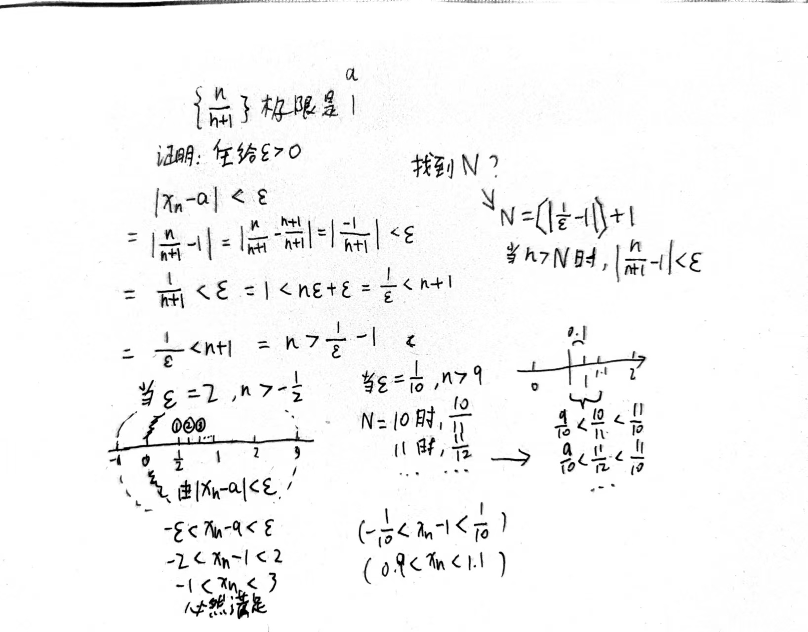

## 数列极限
定义: 对于一个实数数列{a_n}，如果存在一个实数 L，对于任意给定的正实数 ε（无论多么小），总存在正整数 N，使得当 n > N 时，就有 |a_n - L| < ε 成立，那么我们称数列 {a_n} 的极限为 L，记作 lim(a_n) = L 或者 a_n → L。

换句话说，数列的极限 L 是指当数列的项足够靠近 L 时，这个数列的后续项都会无限地靠近 L。ε 实际上是一个很小的范围，当数列的值在以 L 为中心、ε 为半径的范围内时，就可以认为这些值都接近 L。

#### 例1

