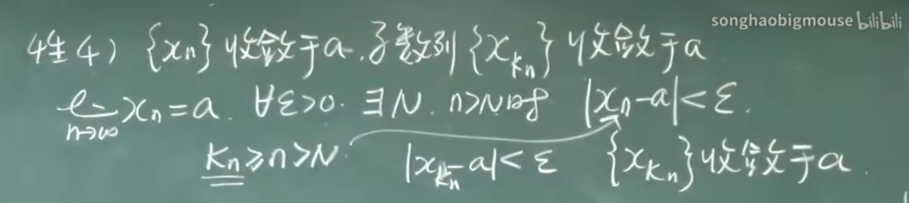

## 一、微积分

	1.	函数与极限
	•	函数的概念与性质
	•	极限与连续
	2.	一元微分学
	•	导数与微分
	•	导数的应用（如单调性、极值、凹凸性等）
	•	洛必达法则
	•	泰勒公式
	3.	一元积分学
	•	不定积分
	•	定积分
	•	积分的应用（如面积、体积、弧长等）
	•	反常积分
	4.	多元微积分
	•	多元函数与偏导数
	•	重积分
	•	曲线积分与曲面积分
	•	格林公式、高斯公式与斯托克斯公式

### 数列极限

#### 定义:

对于一个实数数列{a_n}，如果存在一个实数 L，对于任意给定的正实数 ε（无论多么小），总存在正整数 N，使得当 n > N 时，就有 |a_n - L| < ε 成立，那么我们称数列 {a_n} 的极限为 L，记作 lim(a_n) = L 或者 a_n → L。

换句话说，数列的极限 L 是指当数列的项足够靠近 L 时，这个数列的后续项都会无限地靠近 L。ε 实际上是一个很小的范围，当数列的值在以 L 为中心、ε 为半径的范围内时，就可以认为这些值都接近 L。

#### 例1

#### 等式两边求对数后等式成立吗？

当对等式两边同时取对数时，等式是否成立取决于所取的对数函数。如果取自然对数（以e为底的对数，通常表示为ln），那么等式仍然成立；如果取常用对数（以10为底的对数，通常表示为log），也可以成立。

#### 当 |q| < 1 时，log q 的值为负数。

#### 例2

#### 不等式两边同时取x次方，仍然成立吗

1. 如果 ( x ) 是一个正实数，并且不等式两边的所有数都是正实数，那么不等式仍然成立。这是因为正实数的幂运算不改变不等式的方向。
2. 如果 ( x ) 是一个负实数或者是一个小数，并且不等式中包含负数或小数，那么不等式的方向可能会发生变化。取决于 ( x ) 的具体值以及不等式中的数值大小关系。
3. 在某些特殊情况下，不等式的方向可能会保持不变，但这取决于具体的不等式形式和 ( x ) 的取值范围。

#### 例3

#### 性质：

1. {Xn}收敛，极限唯一

2. {Xn}收敛，有界
   1. 有界是收敛的必要条件，不是充分条件
   2. 单调有界，则有极限

3. limXn n->∞ a>0(a<0) 存在N，n>N时Xn>0

4. {Xn}收敛于a，子数列{X(Kn)}收敛于a

   证明

   

   1. 推论
      1. 找到一个子数列不收敛，则原数列发散
      2. 找到两个子数列，虽然都收敛，但是极限不同，原数列发散
      3. 原数列收敛的 充分必要条件是 奇数列和偶数列构成的子数列收敛，且极限相同
      4. 找到一个子数列收敛，原数列不一定收敛

### 函数极限

#### 定义:

#### 常用的倒数

要化简不等式 $( \frac{1}{2^x} < a )$，可以按照以下步骤进行：

1. 首先，将底数改写为指数形式，得到 $( 2^{-x} < a )$。
2. 接着，将不等式两边取倒数，并注意改变不等号的方向，得到$ ( \frac{1}{2^{-x}} > \frac{1}{a} )$。
3. 然后，根据指数的倒数规则，将$ ( 2^{-x} ) $改写为$ ( 2^x )，得到 ( 2^x > \frac{1}{a} )$。
4. $当以 (e) 为底时，(2) 的 (x) 次方取自然对数的结果为 (\ln(2^x))。根据对数的性质，(\ln(2^x) = x \cdot \ln(2))$

#### 例1：$lim(1/2){^x}=0$

$\forall x \exist x$ 

#### 定义2：x->x0

#### 定义3：左极限右极限

性质：

1. lim f(x)存在，是唯一的
2. 局部有界性：lim f(x)存在，存在x0的去心邻域
3. 局部保号性：lim f(x) = a，a>0，在去心邻域里f(x)>0
4. lim f(x)=a (x->x0) 充要条件 当x->x0时，取任意数列{Xn}，当lim Xn (n->+∞) 以X0为极限的时候，代进去lim f(Xn) (n->+∞) = a

#### 例1

### 无穷小与无穷大

#### 例1：lim x->0 x sin(1/x) = 0

 sin(1/x)有界，有界乘以趋于0的就是0

### 链式法则

### sin(x)'=cos(x)

单变量微积分

---

### $\frac{d}{dx} (\ln u(x)) = \frac{u{\prime}(x)}{u(x)}$

(ln x)' = 1/x

---

### $v = x^x$ 导数

ln v = x ln x ; 

(ln v)' = ln x + x * 1/x

v'/v = 1 + ln x

v' = v (1 + ln x)将v=x^x代入

$dx^x/dx = x^x (1 + ln x)$

---

### $\lim_{n \to \infty} (1 + \frac{1}{n})^n$ 为什么 = e

ln 答案 = $ln(1 + 1/n)^n = n*ln(1+1/n)$

设$\Delta x$ = 1/n -> 0

= $1/\Delta x$ $ ln(1+\Delta x)$

= $1/\Delta x$ $ln(1+\Delta x) - ln 1$

可以看做d lnx / dx | x = 1

因为ln x' = 1/x，所以d lnx / dx | x = 1结果为1

ln 答案 = $ln(\lim_{n \to \infty} (1 + \frac{1}{n})^n)$ = 1

答案 = $\lim_{n \to \infty} (1 + \frac{1}{n})^n = e^{ln(\lim_{n \to \infty} (1 + \frac{1}{n})^n)}$ = e

使用线性近似

$ln(a_k) = ln(1 + 1/k)^k = k*ln(1+1/k)$

因为ln(1+x) ~= x

ln(a_k) = k*(1/k) = 1, 

---

### 证明$\frac{dx^r}{dx}=rx^{r-1}$

1. $x^r = (e^{lnx})^r = e^{rlnx} = e^{rlnx} * (rlnx)'$
2. $u=x^r$，$\frac{u'}{u} = (lnu)'=\frac r x$，$u'=x^r\frac r x$

---

### $f(x) \approx f(x_0) + f'(x_0)*(x - x_0)$

$\frac{\Delta f} {\Delta x} \approx f'(x_0)$ ($\Delta x = x - x_0$) 当x=x0时，和上面公式一样

ln 1.1 = ?

x0 在 0 时，ln(1+x) ~= f(0) + f'(0)f(x-x0) ~= ln(1) + 1/1+0 * (x - 0) ~= x

x0 在 0 时，(1+x)^r ~= 1 + r(1+0)^r-1 * (x - 0) ~= 1 + rx

ln(1.1)，0.1 ~= 0，~= ln(1 + 1/10)，由上x=1/10，ln(1.1) ~= 1/10

常用：sinx ~= x, cosx ~= 1, e^x ~= 1 + x（x ~= 0）

$\frac {e^{-3x}} {\sqrt {1+x}}$ = e^-3x * (1+x)^1/2 ~= (1-3x) (1 - 1/2x), drop x^2 and higher

$f(x) \approx f(x_0) + f'(x_0)*(x - x_0) + \frac {f''(x_0)} 2 (x-x_0)^2$

why 1/2 f''(x0)?

f(x) = a + bx + cx^2, f(0) = a

f'(x) = b + 2cx, f'(0) = b

f''(x) = 2c, 1/2 f''(0) = c

---

### 已知加水速率dV/dt = 2

r/h = 4/10, V = 1/3 πr^2h

what is dh/dt when h = 5?

r = 2/5h, V = 1/3 π (2/5h)^2 h

2 = dV/dt = π/3 (2/5)^2 3h^2 dh/dt

dh/dt = 1/2π (升/秒)

---

### 牛顿迭代法

$x_{n+1} = x_n - \frac {f(x_n)} {f'(x_n)}$ 

slove x^2 = 5

从x0 = 2开始，f(x) = x^2 - 5, f'(x) = 2x

$x_1 = x_0 - \frac {x_0^2 - 5} { 2x0} = x_0 - 1/2x_0 + 5/2x_0$

x1 = 1/2 * 2 + 5/4 = 9/4

x2 = 1/2 * 9/4 + 5/2 * 4/9 = 161/72

x3 = 1/2 * 161/72 + 5/2 * 161/72

相同写法

slove (64.1)^(1/3) ~= ?

y = x^1/3, dy = 1/3^(-2/3) dx（dy，dx视作无限小，只是题目取1/10）

A + x = 64, y = 64^(1/3) = 4

dy = 1/3(64)^(-2/3) dx = 1/3 * 1/16 dx = 1/48 dx （线性近似结果）

dx = 1/10, dy = 1/48 dx = 1/480

64.1^(1/3) ~= y + dy = 4 + 1/480

---

换元法：$\int x^3(x^4+2)^5dx$

u = x^4 + 2, du = 4x^3 dx

= $\int \frac {u^5du} {4} = \frac {1} {24} u^6 + C = \frac {1} {24} (x^4 + 2)^6 + C$

### 中值定理

费马定理

f在极值点x0 ∈ (a, b)处可导 => f'(x0) = 0

罗尔中值定理

f在[a, b]连续，(a, b)可导

f(a) = f(b) => $\exist \zeta \in $(a,b), f'($\zeta$) = 0

拉格朗日中值定理

f在[a, b]连续，(a, b)可导

=> $\exist \zeta \in (a, b), s.t. f'(\zeta) = \frac {f(b) - f(a)} {b - a}$ 

科西中值定理

f，g在[a, b]连续，(a, b)可导，g'(x) != 0, $\forall x \in (a,b)$ 

=> $\exist \zeta \in (a,b), s.t. \frac {f(b) - f(a)} {g(b) - g(a)} = \frac {f'(\zeta)} {g'(\zeta)}$ 

---

### $G(x) = \int g(x)dx $

积分的唯一性

if F' = G', F(x) = G(x) + c

## 二、线性代数

	1.	行列式
	•	行列式的定义与性质
	2.	矩阵
	•	矩阵的基本运算
	•	逆矩阵
	•	矩阵的秩
	3.	向量空间
	•	向量的线性组合与线性相关性
	•	基与维数
	4.	线性变换
	•	线性变换与矩阵的关系
	5.	特征值与特征向量
	•	特征值的定义与性质
	•	矩阵的对角化
	6.	二次型

## 三、常微分方程

	1.	一阶微分方程
	•	分离变量法
	•	齐次方程与非齐次方程
	•	一阶线性微分方程
	2.	高阶微分方程
	•	常系数齐次线性微分方程
	•	常系数非齐次线性微分方程
	•	拉普拉斯变换
	3.	微分方程的应用
	•	物理、工程中的微分方程模型

## 四、无穷级数

	1.	数项级数
	•	收敛与发散
	•	收敛判别法
	2.	幂级数
	•	幂级数的收敛半径与收敛区间
	•	泰勒级数
	3.	傅里叶级数
	•	傅里叶级数的基本理论

## 五、向量分析

	1.	向量代数与解析几何
	•	向量的运算
	•	空间解析几何
	2.	向量函数
	•	向量函数的极限与连续性
	•	向量函数的导数与积分

## 六、复变函数

	1.	复数与复平面
	•	复数的基本运算
	•	复平面与复数的几何意义
	2.	解析函数
	•	解析函数的定义与性质
	•	柯西-黎曼方程
	3.	复积分
	•	复积分的基本概念
	•	柯西积分定理与积分公式
	4.	级数展开
	•	复变函数的幂级数展开
	•	势级数与留数定理

## 七、概率与统计

	1.	概率论基础
	•	概率的基本概念
	•	随机变量与分布
	•	数学期望与方差
	2.	数理统计
	•	抽样分布
	•	参数估计
	•	假设检验

## 八、数值分析

	1.	插值法
	•	拉格朗日插值
	•	牛顿插值
	2.	数值积分与数值微分
	3.	线性方程组的数值解法
	4.	常微分方程的数值解法

