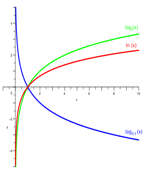
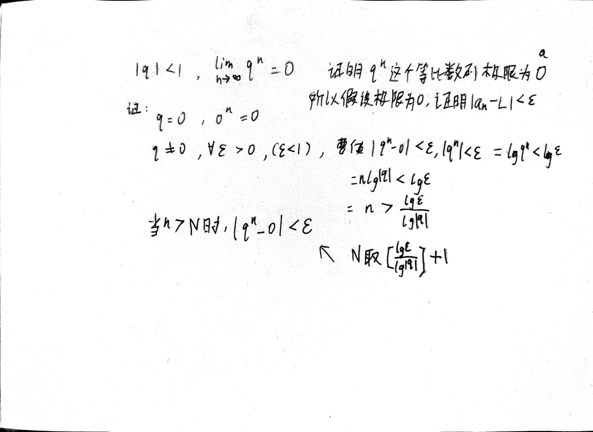
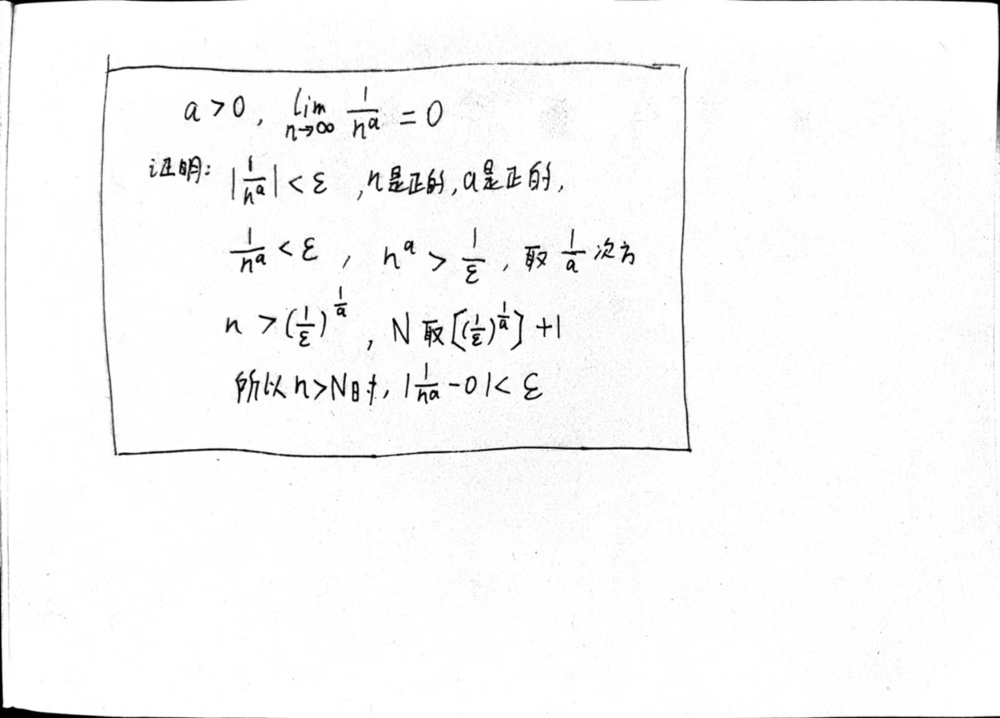
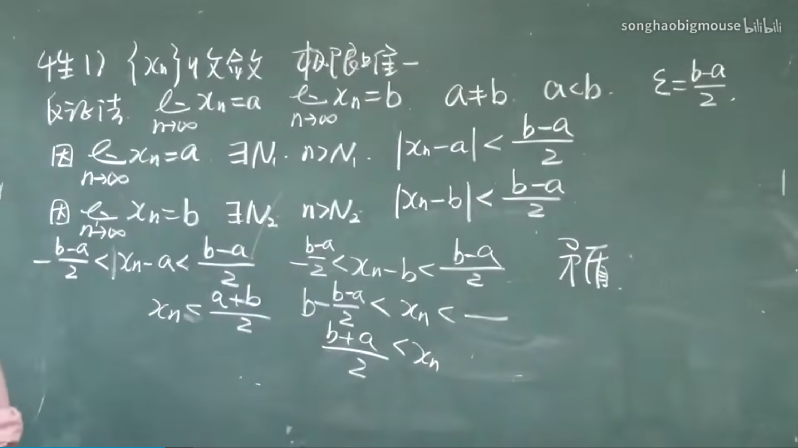
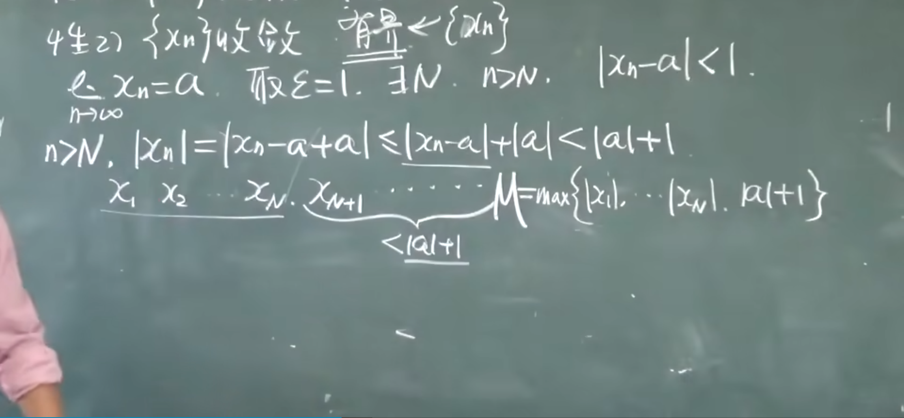

## 数列极限
#### 定义:

对于一个实数数列{a_n}，如果存在一个实数 L，对于任意给定的正实数 ε（无论多么小），总存在正整数 N，使得当 n > N 时，就有 |a_n - L| < ε 成立，那么我们称数列 {a_n} 的极限为 L，记作 lim(a_n) = L 或者 a_n → L。

换句话说，数列的极限 L 是指当数列的项足够靠近 L 时，这个数列的后续项都会无限地靠近 L。ε 实际上是一个很小的范围，当数列的值在以 L 为中心、ε 为半径的范围内时，就可以认为这些值都接近 L。

#### 例1

#### 等式两边求对数后等式成立吗？

当对等式两边同时取对数时，等式是否成立取决于所取的对数函数。如果取自然对数（以e为底的对数，通常表示为ln），那么等式仍然成立；如果取常用对数（以10为底的对数，通常表示为log），也可以成立。

#### 当 |q| < 1 时，log q 的值为负数。

#### 例2

#### 不等式两边同时取x次方，仍然成立吗

1. 如果 ( x ) 是一个正实数，并且不等式两边的所有数都是正实数，那么不等式仍然成立。这是因为正实数的幂运算不改变不等式的方向。
2. 如果 ( x ) 是一个负实数或者是一个小数，并且不等式中包含负数或小数，那么不等式的方向可能会发生变化。取决于 ( x ) 的具体值以及不等式中的数值大小关系。
3. 在某些特殊情况下，不等式的方向可能会保持不变，但这取决于具体的不等式形式和 ( x ) 的取值范围。

#### 例3

#### 性质：

1. {Xn}收敛，极限唯一

2. {Xn}收敛，有界

